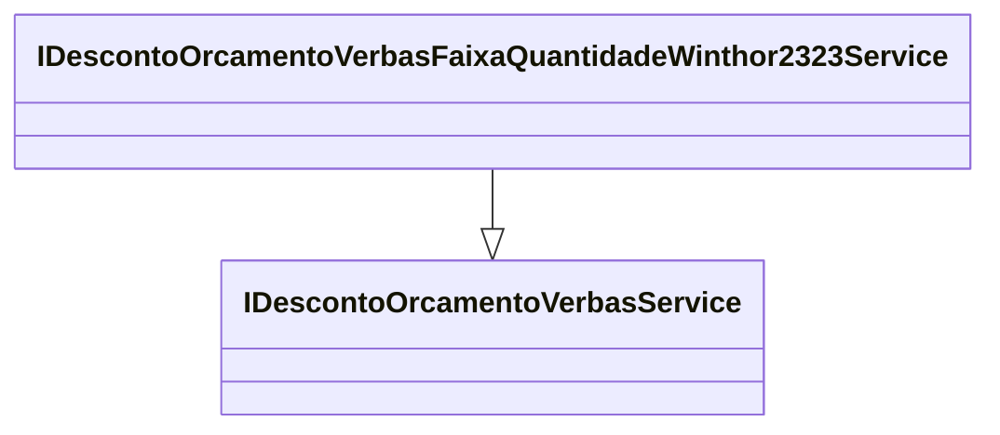

# IDescontoOrcamentoVerbasFaixaQuantidadeWinthor2323Service

**Namespace**: IsthmusWinthor.Dominio.Model.Verbas.Interfaces.Descontos  
**Nome do Arquivo**: IDescontoOrcamentoVerbasFaixaQuantidadeWinthor2323Service.cs  

## Visão Geral e Responsabilidade
A interface `IDescontoOrcamentoVerbasFaixaQuantidadeWinthor2323Service` é responsável por definir um contrato específico para serviços que implementam lógicas relacionadas a descontos aplicados a orçamentos, considerando as faixas de quantidade. Esta interface amplia a funcionalidade do `IDescontoOrcamentoVerbasService`, permitindo a implementação de regras de negócio que garantem a aplicação correta de descontos em situações específicas, ajudando a otimizar a gestão financeira em processos orçamentários.

## Métodos de Negócio
Como esta é uma interface, não possui implementação direta, mas define que as classes concretas que a implementam devem fornecer os seguintes métodos que garantirão as regras de negócio:

- **Título**: `CalcularDesconto` (visibilidade padrão)
    - **Objetivo**: Este método deve assegurar o cálculo do desconto pertinente conforme as faixas de quantidade especificadas.
    - **Comportamento**: A lógica de cálculo incluirá condições que verificam a quantidade de itens no orçamento e aplicam um percentual de desconto apropriado a cada faixa. As regras de negócio implementadas nas classes que concretizam esta interface devem considerar as tabelas de desconto e os limites especificados.
    - **Retorno**: O valor retornado representa o desconto total a ser aplicado ao orçamento, garantindo que a política de precificação da empresa seja mantida.

## Propriedades Calculadas e de Validação
Esta interface não define diretamente propriedades, mas as classes concretas que a implementam podem oferecer propriedades relacionadas ao cálculo de descontos, as quais podem incluir validações sobre a faixa e os limites de quantidade.

## Navigations Property
Esta interface não possui propriedades complexas do domínio que se conectem diretamente a outras entidades.

## Tipos Auxiliares e Dependências
- Dependências de `IDescontoOrcamentoVerbasService` que esta interface estende.

## Diagrama de Relacionamentos

---
Gerada em 29/12/2025 21:24:09
