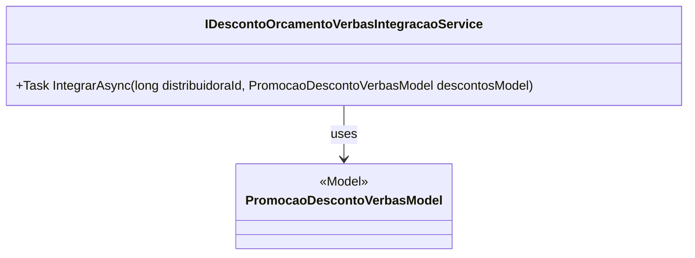

# IDescontoOrcamentoVerbasIntegracaoService

**Namespace**: IsthmusWinthor.Dominio.Model.Verbas.Interfaces.Descontos  
**Nome do Arquivo**: IDescontoOrcamentoVerbasIntegracaoService.cs  

## Visão Geral e Responsabilidade
A interface `IDescontoOrcamentoVerbasIntegracaoService` atua como um contrato para a integração de descontos em orçamentos de verbas. Ela é responsável por garantir que a aplicação possa integrar informações de desconto provenientes de uma distribuidora, permitindo a atualização e a consistência dos dados relacionados a promoções e verbas financeiras.

## Métodos de Negócio

### Método: `IntegrarAsync` (Público)
- **Objetivo**: Este método garante a integração de dados de desconto entre a distribuidora e os orçamentos de verbas, assegurando que as informações de desconto sejam corretamente aplicadas ao modelo adequado, evitando inconsistências financeiras.
- **Comportamento**:
  1. O método recebe um `distribuidoraId` e um modelo de `PromocaoDescontoVerbasModel`, que contém os detalhes dos descontos a serem integrados.
  2. A integração deve realizar operações assíncronas para permitir a manutenção do desempenho da aplicação durante o processo de comunicação com serviços externos.
  3. Retorna um identificador longo (`long`), que pode representar o resultado da operação de integração, como o ID do orçamento atualizado ou um código de status que representa a conclusão do processo.
- **Retorno**: Um valor do tipo `long`, que representa o resultado da operação de integração, como o ID do orçamento que foi processado.

## Propriedades Calculadas e de Validação
Não há propriedades calculadas ou de validação nesta interface, uma vez que ela define apenas um contrato e não contém implementações de lógica de negócios ou propriedades.

## Navigations Property
Não existem propriedades complexas do domínio a serem listadas, uma vez que esta é uma interface.

## Tipos Auxiliares e Dependências
- [PromocaoDescontoVerbasModel](PromocaoDescontoVerbasModel.md): Modelo utilizado para especificar a estrutura dos dados de desconto que serão integrados.

## Diagrama de Relacionamentos

---
Gerada em 29/12/2025 21:24:23
