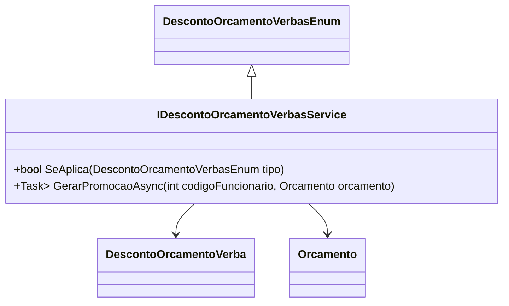

# IDescontoOrcamentoVerbasService
**Namespace**: IsthmusWinthor.Dominio.Model.Verbas.Interfaces.Descontos  
**Nome do Arquivo**: IDescontoOrcamentoVerbasService.cs  

## Visão Geral e Responsabilidade
A interface `IDescontoOrcamentoVerbasService` atua como um contrato que define operações relacionadas à aplicação de descontos em orçamentos. Ela é fundamental na modelagem do processo de concessão de descontos, garantindo que os descontos sejam aplicáveis de acordo com tipos específicos e gerando promoções relacionadas ao orçamento de um funcionário. Este serviço assegura que as regras de negócio sobre descontos sejam respeitadas, facilitando a aplicação correta e a manutenção da integridade dos dados financeiros da empresa.

## Métodos de Negócio

### 1. SeAplica (bool)
- **Objetivo**: Determinar se um tipo específico de desconto é aplicável a um determinado contexto.
- **Comportamento**: 
  - O método aceita um parâmetro do tipo `DescontoOrcamentoVerbasEnum`, que representa um tipo de desconto.
  - Em seguida, avalia se o desconto pode ser aplicado baseado nas regras de negócio definidas para cada tipo.
  - Retorna `true` se o desconto se aplica, e `false` caso contrário.
- **Retorno**: `bool` - Indica a aplicabilidade do tipo de desconto especificado.

### 2. GerarPromocaoAsync (Task<IEnumerable<DescontoOrcamentoVerba>>)
- **Objetivo**: Criar uma promoção com base no orçamento de um funcionário, considerando as regras de aplicação de desconto.
- **Comportamento**:
  - O método é assíncrono e recebe dois parâmetros: `codigoFuncionario` e `orcamento`.
  - Primeiramente, valida as informações fornecidas (como a existência do funcionário e a validade do orçamento).
  - Em seguida, gera as verbas de desconto aplicáveis através da lógica de promoção, que pode envolver cálculo ou criação de objetos que representem as verbas.
  - Retorna uma lista de objetos do tipo `DescontoOrcamentoVerba` representando as verbas geradas para o funcionário e o orçamento correspondentes.
- **Retorno**: `Task<IEnumerable<DescontoOrcamentoVerba>>` - Uma coleção de verbas de desconto geradas.

## Propriedades Calculadas e de Validação
Não há propriedades calculadas ou de validação na interface, pois ela define apenas métodos.

## Navigations Property
Não há propriedades de navegação na interface.

## Tipos Auxiliares e Dependências
- Enum: [DescontoOrcamentoVerbasEnum](DescontoOrcamentoVerbasEnum.md)
- Classe: [Orcamento](Orcamento.md)
- Classe: [DescontoOrcamentoVerba](DescontoOrcamentoVerba.md)

## Diagrama de Relacionamentos

---
Gerada em 29/12/2025 21:24:41
