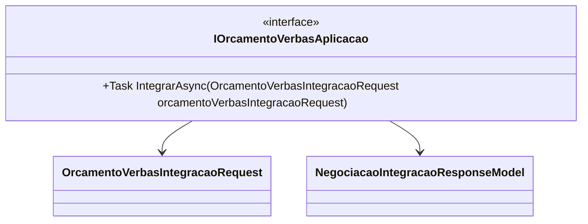

# IOrcamentoVerbasAplicacao
- **Namespace**: IsthmusWinthor.Dominio.Model.Verbas.Interfaces
- **Nome do Arquivo**: IOrcamentoVerbasAplicacao.cs

## Visão Geral e Responsabilidade
A interface `IOrcamentoVerbasAplicacao` desempenha um papel crucial na integração de dados orçamentários dentro do sistema, permitindo que solicitações de integração sejam realizadas de forma assíncrona. Seu objetivo principal é garantir que os dados orçamentários sejam corretamente processados e integrados a outros sistemas ou partes do sistema, facilitando a negociação e a gestão de verbas.

## Métodos de Negócio

### Título: IntegrarAsync (Público)
- **Objetivo**: Garante que a integração de dados orçamentários ocorra de maneira eficiente e que os dados sejam validados antes da integração.
- **Comportamento**: 
  1. Recebe um objeto do tipo `OrcamentoVerbasIntegracaoRequest`.
  2. Realiza validações nos dados contidos no objeto de solicitação.
  3. Executa a lógica de integração, comunicando-se com os sistemas relevantes ou bases de dados.
  4. Retorna um objeto do tipo `NegociacaoIntegracaoResponseModel`, encapsulando o resultado da operação.
- **Retorno**: Um objeto `NegociacaoIntegracaoResponseModel` que contém os detalhes sobre o resultado da integração, incluindo informações de sucesso ou falha.

## Propriedades Calculadas e de Validação
N/A - A interface define apenas um contrato para o método, não contém propriedades com lógica de cálculo ou validações.

## Navigations Property
N/A - A interface não contém propriedades complexas do domínio.

## Tipos Auxiliares e Dependências
- [OrcamentoVerbasIntegracaoRequest](OrcamentoVerbasIntegracaoRequest.md)
- [NegociacaoIntegracaoResponseModel](NegociacaoIntegracaoResponseModel.md)

## Diagrama de Relacionamentos

A interface `IOrcamentoVerbasAplicacao` define a estrutura necessária para a integração de verbas orçamentárias no sistema, assegurando que qualquer classe que implemente essa interface atenda a essa funcionalidade crítica.
---
Gerada em 29/12/2025 21:22:46
