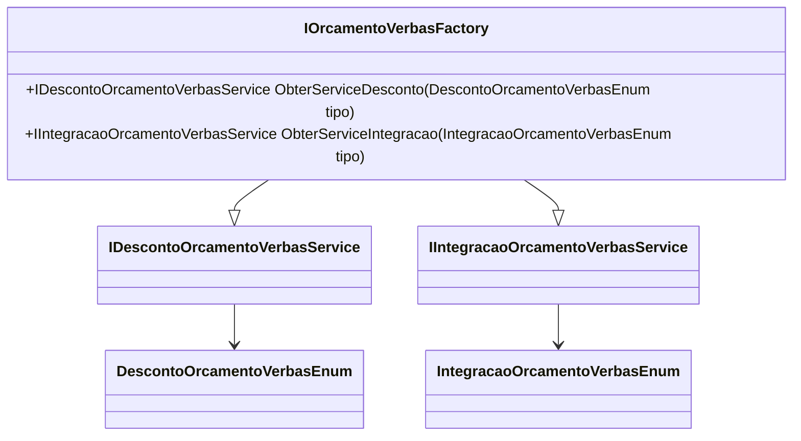

# IOrcamentoVerbasFactory
**Namespace**: IsthmusWinthor.Dominio.Model.Verbas.Interfaces  
**Nome do Arquivo**: IOrcamentoVerbasFactory.cs  

### Visão Geral e Responsabilidade
A interface `IOrcamentoVerbasFactory` tem o papel de fornecer serviços específicos relacionados ao orçamento de verbas, oferecendo métodos que retornam implementações de serviços com base em enumerações de tipos de desconto e integração. Essa interface abrange a criação de componentes de serviço, facilitando a extensibilidade e a manutenção do sistema ao permitir que diferentes tipos de serviços possam ser facilmente integrados e utilizados.

### Métodos de Negócio

#### Título: `ObterServiceDesconto(DescontoOrcamentoVerbasEnum tipo)` - **Visibilidade: Público**
- **Objetivo**: Garante a obtenção do serviço de desconto correspondente ao tipo especificado, permitindo que o sistema aplique lógicas de desconto dinâmicas durante o processamento de orçamentos.
- **Comportamento**: O método recebe como parâmetro um tipo de desconto do enumerado `DescontoOrcamentoVerbasEnum`. Ele identifica a implementação específica de `IDescontoOrcamentoVerbasService` associada a esse tipo e a retorna ao chamador.
- **Retorno**: Um objeto do tipo `IDescontoOrcamentoVerbasService`, que encapsula a lógica de desconto necessária para o orçamento em questão.

#### Título: `ObterServiceIntegracao(IntegracaoOrcamentoVerbasEnum tipo)` - **Visibilidade: Público**
- **Objetivo**: Garante a obtenção do serviço de integração correspondente ao tipo especificado, permitindo que o sistema integre-se corretamente com sistemas externos durante a manipulação de verbas orçamentárias.
- **Comportamento**: O método recebe um tipo de integração do enumerado `IntegracaoOrcamentoVerbasEnum` como entrada. Com isso, ele localiza e fornece a implementação correta de `IIntegracaoOrcamentoVerbasService` que corresponde a esse tipo.
- **Retorno**: Um objeto do tipo `IIntegracaoOrcamentoVerbasService`, que contém a lógica necessária para a integração com sistemas externos.

### Tipos Auxiliares e Dependências
- **Enumeradores**:
  - [DescontoOrcamentoVerbasEnum](DescontoOrcamentoVerbasEnum.md)
  - [IntegracaoOrcamentoVerbasEnum](IntegracaoOrcamentoVerbasEnum.md)
- **Interfaces**:
  - [IDescontoOrcamentoVerbasService](IDescontoOrcamentoVerbasService.md)
  - [IIntegracaoOrcamentoVerbasService](IIntegracaoOrcamentoVerbasService.md)

### Diagrama de Relacionamentos

Esta documentação busca simplificar a compreensão das funcionalidades e regras de negócio da interface `IOrcamentoVerbasFactory`, servindo como um guia abrangente para desenvolvedores e arquitetos que trabalham no domínio de verbas orçamentárias.
---
Gerada em 29/12/2025 21:23:09
