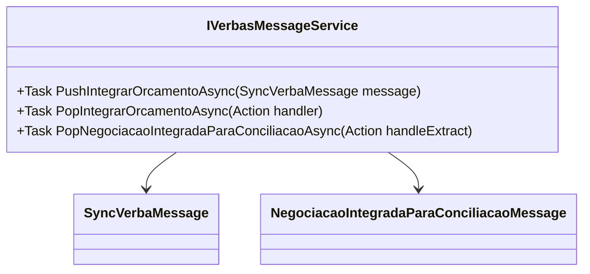

# IVerbasMessageService

**Namespace**: IsthmusWinthor.Dominio.Model.Verbas.Interfaces  
**Nome do Arquivo**: IVerbasMessageService.cs  

---

## Visão Geral e Responsabilidade
A interface `IVerbasMessageService` atua como um mediador no processo de integração de mensagens relacionadas ao orçamento e à negociação dentro do sistema. Sua principal responsabilidade é garantir a comunicação assíncrona entre os diferentes componentes do sistema que precisam processar ou reagir a eventos relacionados a verbas, como a integração de orçamentos ou a negociação para conciliação. Ela resolve o problema de garantir que as ações corretas sejam disparadas em resposta a mensagens específicas, mantendo a fluidez no processamento de dados.

## Métodos de Negócio

### PushIntegrarOrcamentoAsync
- **Visibilidade**: `public`
- **Objetivo**: Este método garante que uma mensagem de integração de orçamento seja enviada para o sistema para processamento, permitindo que as atualizações orçamentárias sejam implementadas de maneira oportuna.
- **Comportamento**: 
  1. Recebe uma instância de `SyncVerbaMessage` como argumento.
  2. Realiza a operação assíncrona de envio da mensagem para o sistema de gestão de verbas.
  3. A operação inicia a atualização do orçamento correspondente no sistema.
- **Retorno**: Este método não retorna um valor, mas completa a operação de integração que pode ser verificada pelos processos que consomem essa mensagem.

### PopIntegrarOrcamentoAsync
- **Visibilidade**: `public`
- **Objetivo**: Garante que mensagens de integração de orçamento sejam processadas quando disponíveis, permitindo que o sistema reaja a novos dados de forma dinâmica.
- **Comportamento**: 
  1. Inicia um procedimento assíncrono para escutar a fila de mensagens.
  2. Quando uma nova `SyncVerbaMessage` é recebida, o `handler` fornecido é chamado com a mensagem como argumento.
  3. O sistema processa a mensagem conforme definido pelo manipulador.
- **Retorno**: Este método não retorna um valor, mas permite que o chamador forneça um manipulador para processar a mensagem recebida.

### PopNegociacaoIntegradaParaConciliacaoAsync
- **Visibilidade**: `public`
- **Objetivo**: Garante que mensagens de negociação integrada para conciliação sejam tratadas, permitindo que o sistema integre dados de negociação ao processo de conciliação.
- **Comportamento**: 
  1. Inicia um procedimento assíncrono, aguardando novas mensagens do tipo `NegociacaoIntegradaParaConciliacaoMessage`.
  2. Uma vez que a mensagem é recebida, o `handleExtract` é chamado para permitir que o sistema reaja apropriadamente.
  3. A operação suporta a continuidade na integração dos dados de negociação.
- **Retorno**: Este método não retorna um valor, mas facilita o tratamento de mensagens que são cruciais para a conciliação.

## Navigations Property
- Não existem propriedades de navegação nesta interface, já que ela define métodos e não contém estados ou propriedades.

## Tipos Auxiliares e Dependências
- `SyncVerbaMessage` - [SyncVerbaMessage](SyncVerbaMessage.md)
- `NegociacaoIntegradaParaConciliacaoMessage` - [NegociacaoIntegradaParaConciliacaoMessage](NegociacaoIntegradaParaConciliacaoMessage.md)

## Diagrama de Relacionamentos

---
Gerada em 29/12/2025 21:23:35
