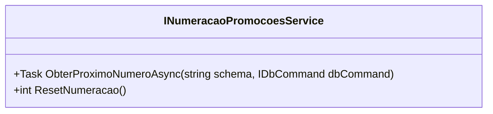

# INumeracaoPromocoesService
**Namespace**: IsthmusWinthor.Dominio.Model.Verbas.Interfaces.NumeracaoPromocoes  
**Nome do Arquivo**: INumeracaoPromocoesService.cs  

## Visão Geral e Responsabilidade
A interface `INumeracaoPromocoesService` é responsável por gerenciar a numeração de promoções dentro do sistema, garantindo que cada promoção receba um número único e sequencial. Isso é crucial para a integridade dos dados e para evitar conflitos durante a criação ou edição de promoções, permitindo um controle eficaz e organizado das promoções no ambiente corporativo.

## Métodos de Negócio

### Título: `ObterProximoNumeroAsync` (Público)
- **Objetivo**: Garante que seja fornecido o próximo número disponível para uma promoção, com base no esquema definido.
- **Comportamento**: 
  1. Recebe como entrada um `schema` e um comando de banco de dados (`IDbCommand`).
  2. Executa uma operação assíncrona para acessar o próximo número disponível no banco de dados de acordo com a numeração até agora registrada.
  3. Retorna o próximo número a ser utilizado para a promoção, assegurando que o mesmo não foi utilizado anteriormente.
- **Retorno**: Retorna um `int` que representa o próximo número da promoção a ser utilizada.

### Título: `ResetNumeracao` (Público)
- **Objetivo**: Reinicia a contagem das numerações para as promoções, permitindo que as promoções possam recomeçar a ser numeradas.
- **Comportamento**: 
  1. É chamado quando se deseja zerar a numeração atual.
  2. Reseta o estado da numeração no sistema, podendo reiniciar o número para algum padrão ou para zero.
  3. Pode envolver uma atualização no banco de dados ou alteração no estado da aplicação.
- **Retorno**: Retorna um `int` que provavelmente indica o novo estado da numeração, permitindo verifica depois da reinicialização.

## Propriedades Calculadas e de Validação
Não há propriedades calculadas ou de validação, uma vez que esta interface define apenas os contratos de serviço e não armazena estado interno.

## Navigations Property
Não há propriedades de navegação nesta interface, visto que ela não implementa qualquer lógica de entidade complexa.

## Tipos Auxiliares e Dependências
- Não há enumeradores ou classes estáticas/Helpers diretamente relevantes mencionadas nesta interface. No entanto, é importante mencionar as dependências relacionadas ao `IDbCommand` que ela utiliza.

## Diagrama de Relacionamentos

---
Gerada em 29/12/2025 21:25:04
