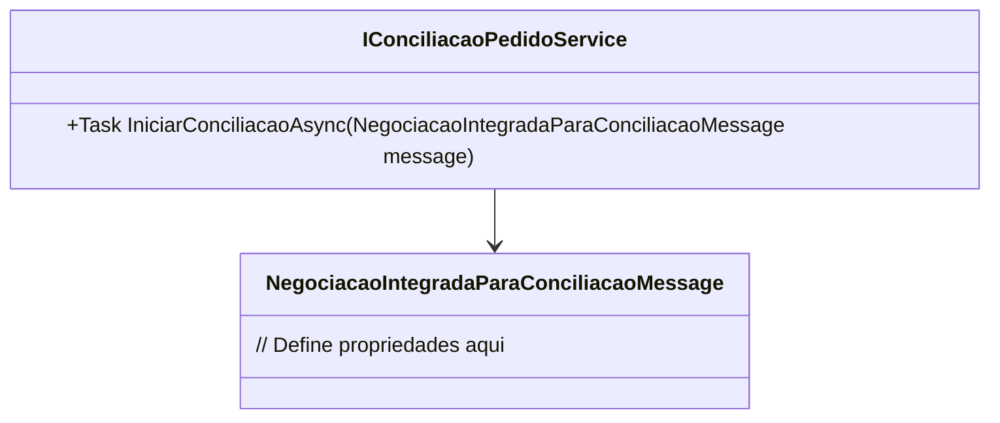

# IConciliacaoPedidoService

**Namespace**: IsthmusWinthor.Dominio.Model.Verbas.Interfaces.Pedidos  
**Nome do Arquivo**: IConciliacaoPedidoService.cs  

## Visão Geral e Responsabilidade
A interface `IConciliacaoPedidoService` é responsável por definir um contrato para serviços que iniciam a conciliação de pedidos. Este papel é crucial em cenários onde múltiplas negociações precisam ser reconciliadas e integradas, garantindo que todos os dados relacionados estejam sincronizados corretamente, evitando inconsistências financeiras e melhorando a precisão dos relatórios.

## Métodos de Negócio

### Título: IniciarConciliacaoAsync (Público)
- **Objetivo**: Garante a iniciação do processo de conciliação a partir das informações fornecidas na mensagem de negociação.
- **Comportamento**: 
  1. Recebe um objeto `NegociacaoIntegradaParaConciliacaoMessage` que contém os dados necessários para a conciliação.
  2. O método executa a lógica necessária para iniciar o processo de conciliação assíncrona.
  3. Qualquer exceção ou erro durante a conciliação pode ser tratado conforme a implementação específica do serviço.
- **Retorno**: O método retorna uma `Task`, indicando o resultado da operação assíncrona. Se bem-sucedido, a conciliação foi iniciada de forma correta.

## Propriedades Calculadas e de Validação
- Nenhuma propriedade calculada ou de validação foi identificada nesta interface.

## Navigations Property
- Nenhuma propriedade complexa do domínio foi identificada nesta interface, uma vez que se trata de uma interface sem implementações de DTOs ou Models.

## Tipos Auxiliares e Dependências
- [NegociacaoIntegradaParaConciliacaoMessage](NegociacaoIntegradaParaConciliacaoMessage.md): Classe utilizada como parâmetro no método `IniciarConciliacaoAsync`.

## Diagrama de Relacionamentos

---
Gerada em 29/12/2025 21:25:15
