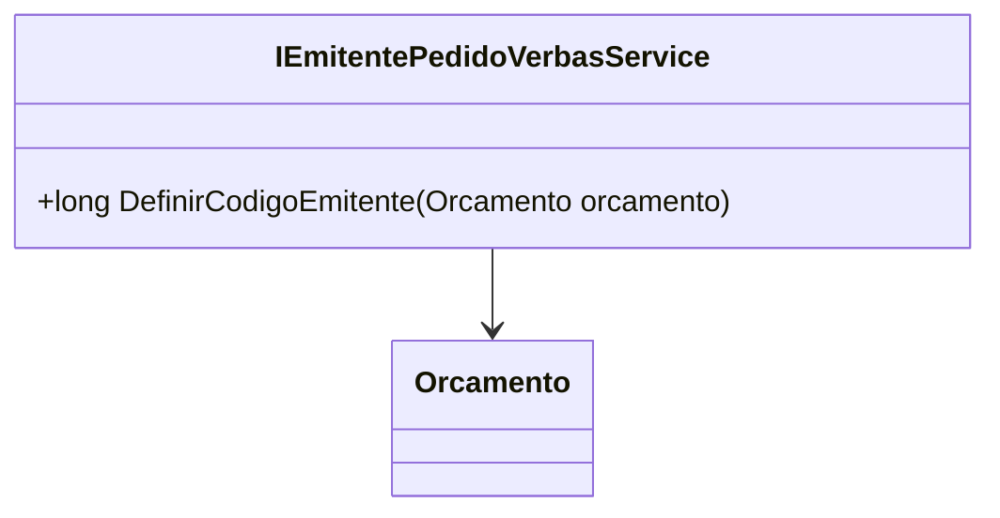

# IEmitentePedidoVerbasService
**Namespace**: IsthmusWinthor.Dominio.Model.Verbas.Interfaces.Pedidos  
**Nome do Arquivo**: IEmitentePedidoVerbasService.cs  

## Visão Geral e Responsabilidade
A interface `IEmitentePedidoVerbasService` representa um contrato para a definição do código do emitente em relação a um orçamento. Sua principal responsabilidade é garantir que o código do emitente associado a um pedido de verba seja atribuído corretamente, de acordo com as regras de negócio da aplicação. Isso é crucial para o correto rastreamento e gerenciamento dos pedidos dentro do sistema.

## Métodos de Negócio

### Título: `DefinirCodigoEmitente` (public)
- **Objetivo**: Garante que um código de emitente único e apropriado seja atribuído a um orçamento, assegurando a integridade dos dados e a correta identificação nas transações.
- **Comportamento**: 
  1. Recebe um objeto `Orcamento` como parâmetro.
  2. Verifica as propriedades do orçamento para determinar a lógica necessária.
  3. Aplica a regra de negócio para definir um código de emitente, que pode envolver a avaliação de certos critérios ou condições associadas ao orçamento.
  4. Retorna o código do emitente que foi definido.
- **Retorno**: Retorna um `long`, que – no contexto do sistema – representa o código do emitente associado ao orçamento.

## Propriedades Calculadas e de Validação
- Não existem propriedades dentro da interface que apresentem lógica no `get` ou validação no `set`.

## Navigations Property
- Não existem propriedades de navegação ou classes complexas associadas a esta interface, pois é uma interface que define métodos e não possui estado.

## Tipos Auxiliares e Dependências
- `Orcamento`: Classe que representa um orçamento no domínio. [Orcamento](Orcamento.md)

## Diagrama de Relacionamentos

Esta documentação técnica fornece uma visão abrangente da interface `IEmitentePedidoVerbasService`, seu propósito dentro do sistema e as regras de negócio envolvidas. O uso de uma abordagem padronizada facilita a legibilidade e a manutenção, permitindo que desenvolvedores e stakeholders compreendam facilmente as funcionalidades e restrições associadas a esta parte do sistema.
---
Gerada em 29/12/2025 21:25:28
