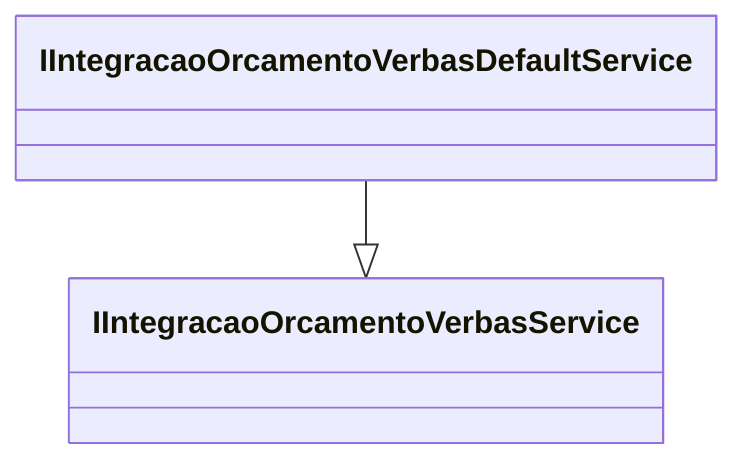

# IIntegracaoOrcamentoVerbasDefaultService

**Namespace**: IsthmusWinthor.Dominio.Model.Verbas.Interfaces.Pedidos  
**Nome do Arquivo**: IIntegracaoOrcamentoVerbasDefaultService.cs  

Este é um interface que define a responsabilidade de integração do sistema com as verbas de orçamento. Ela atua como um ponto de extensão para os serviços de integração de verbas, oferecendo a capacidade de personalização ou especialização através de implementação.

---

## Métodos de Negócio

### Título: Métodos herdados de IIntegracaoOrcamentoVerbasService
- **Objetivo**: Garante que as operações de integração de verbas de orçamento sejam implementadas conforme necessário.
- **Comportamento**: Como esta é uma interface, não contém implementação própria, mas deve assegurar que qualquer classe que a implemente possua a lógica necessária para gerenciar as operações de integração de verbas de orçamento.
- **Retorno**: Não aplicável, pois a interface não implementa comportamento direto; depende das implementações concretas.

---

## Propriedades Calculadas e de Validação
Não há propriedades nesta interface, pois interfaces não definem propriedades com lógica de validação ou cálculo.

---

## Navigations Property
Não existem propriedades de navegação nesta interface, já que ela apenas define contratos de comportamento.

---

## Tipos Auxiliares e Dependências
- Não existem enumeradores ou classes auxiliares statics diretamente relacionadas a esta interface.

---

## Diagrama de Relacionamentos

---

Esta documentação observa a intenção de abstração e especialização da integração de verbas de orçamento no sistema, ajudando a manter uma arquitetura flexível e adaptável às necessidades de negócio.
---
Gerada em 29/12/2025 21:25:36
