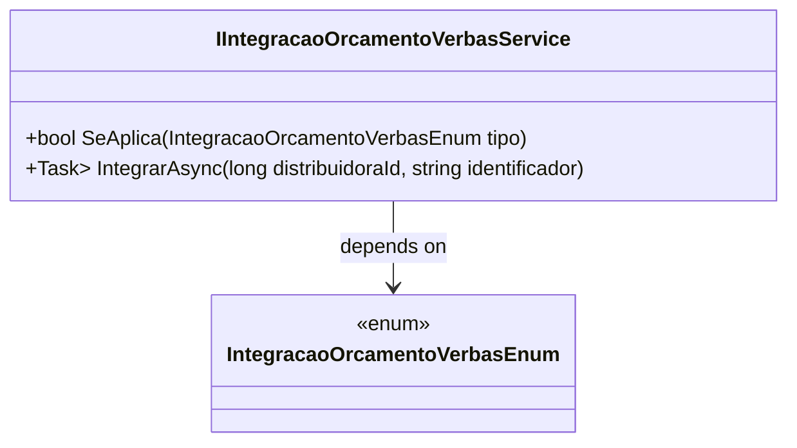

# IIntegracaoOrcamentoVerbasService
**Namespace**: IsthmusWinthor.Dominio.Model.Verbas.Interfaces.Pedidos  
**Nome do Arquivo**: IIntegracaoOrcamentoVerbasService.cs  

Este é um serviço de integração que fornece métodos para verificar a aplicabilidade e integrar dados orçamentários relacionados a verbas.

## Métodos de Negócio

### Título: `SeAplica` (public)
- **Objetivo**: Verificar se um determinado tipo de integração orçamentária se aplica.
- **Comportamento**: 
  1. Recebe um tipo de integração orçamentária como parâmetro.
  2. Avalia se esse tipo é suportado pela lógica de integração do sistema.
  3. Retorna `true` se a integração se aplica, ou `false` caso contrário.
- **Retorno**: Um valor booleano indicando a aplicabilidade do tipo fornecido.

### Título: `IntegrarAsync` (public)
- **Objetivo**: Realizar a integração assíncrona de dados orçamentários.
- **Comportamento**:
  1. Recebe um `distribuidoraId` e um `identificador` como parâmetros.
  2. Realiza a conexão com o serviço de integração responsável.
  3. Obtém os dados necessários para a integração com base nos parâmetros fornecidos.
  4. Retorna uma lista de identificadores longos que representam o resultado da integração.
- **Retorno**: Uma `Task` que resulta em uma coleção de identificadores representando os itens integrados.

## Tipos Auxiliares e Dependências
- **Enumeradores**:
  - [IntegracaoOrcamentoVerbasEnum](IntegracaoOrcamentoVerbasEnum.md)

## Diagrama de Relacionamentos

---
Gerada em 29/12/2025 21:25:47
