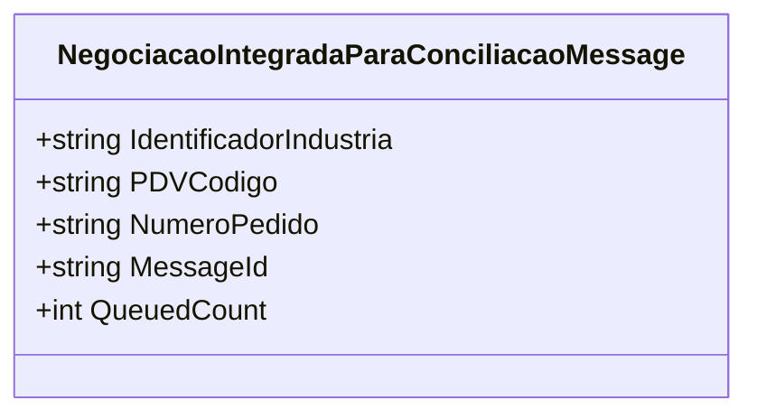

# NegociacaoIntegradaParaConciliacaoMessage

**Namespace**: IsthmusWinthor.Dominio.Model.Verbas.Messages  
**Nome do Arquivo**: NegociacaoIntegradaParaConciliacaoMessage.cs

## Visão Geral e Responsabilidade
A classe `NegociacaoIntegradaParaConciliacaoMessage` representa uma mensagem que encapsula informações necessárias para a concilição de uma negociação integrada. Seu papel é facilitar a comunicação entre serviços garantindo que dados essenciais, como identificador da indústria e informações sobre o ponto de venda e o pedido, sejam transportados de forma segura e estruturada. Isso resolve o problema de integrar diferentes sistemas que necessitam validar e processar informações relacionadas à negociação de forma eficiente.

## Métodos de Negócio
### Método: `MessageId` (Público)
- **Objetivo**: Este método garante que o identificador da mensagem é o mesmo que o número do pedido, funcionando como uma chave única para identificar a transação nas filas de mensagens.
- **Comportamento**: O valor de `NumeroPedido` é retornado sempre que `MessageId` é chamado.
- **Retorno**: Retorna uma string que corresponde ao `NumeroPedido`, o que permite a identificação singular da mensagem nas operações de conciliação.

### Método: `QueuedCount` (Público)
- **Objetivo**: Este método fornece a quantidade de mensagens enfileiradas para esta negociação. Ele é importante para rastreamento e controle de mensagens usando a fila.
- **Comportamento**: Retorna o valor constante de 1, indicando que uma instância da mensagem representa uma única entrada na fila.
- **Retorno**: Retorna um inteiro que sempre será 1, refletindo que esta mensagem refere-se a uma única negociação.

## Propriedades Calculadas e de Validação
Não há propriedades com lógica de cálculo ou validação na classe `NegociacaoIntegradaParaConciliacaoMessage`.

## Navigations Property
Não existem propriedades que representem classes complexas do domínio na classe `NegociacaoIntegradaParaConciliacaoMessage`.

## Tipos Auxiliares e Dependências
Nenhum enumerador ou classe auxiliar está sendo utilizado dentro da classe `NegociacaoIntegradaParaConciliacaoMessage`.

## Diagrama de Relacionamentos

---
Gerada em 29/12/2025 21:25:59
