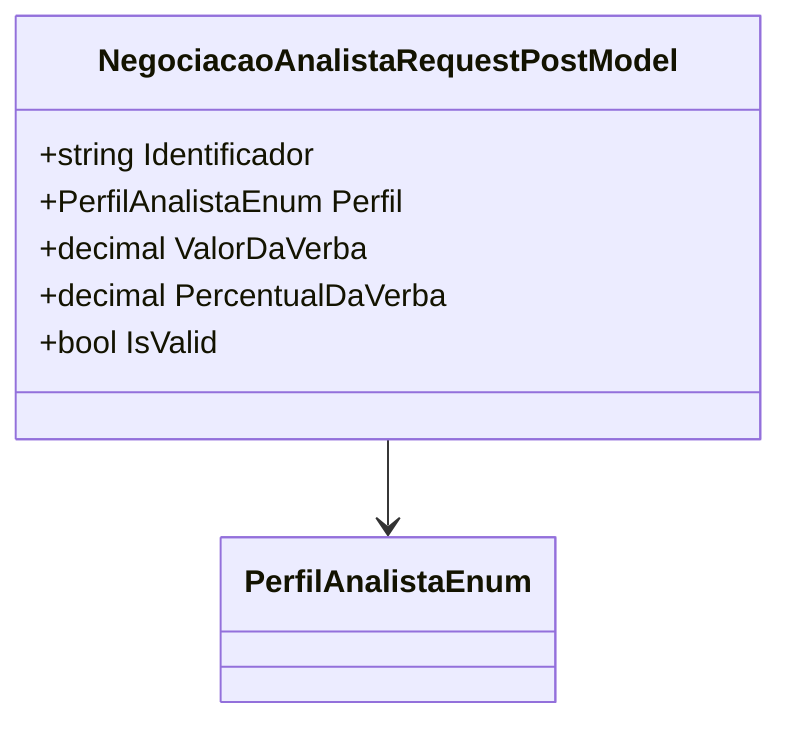

# NegociacaoAnalistaRequestPostModel
**Namespace**: IsthmusWinthor.Dominio.Model.Verbas  
**Nome do Arquivo**: NegociacaoAnalistaRequestPostModel.cs  

A classe `NegociacaoAnalistaRequestPostModel` é responsável por transportar dados necessários para a negociação de verbas por analistas, assegurando que as informações básicas sobre os percentuais e valores envolvidos sejam fornecidas de forma apropriada.

### Propriedades Calculadas e de Validação
- **IsValid** (bool):
  - **Regra**: Esta propriedade indica se o percentual da verba é diferente de zero. A validação assegura que uma negociação de verba só é considerada válida se um percentual for especificado (ou seja, não pode ser zero), refletindo uma condição essencial para a realização de negociações efetivas.

### Tipos Auxiliares e Dependências
- **Enumeradores**:
  - `[PerfilAnalistaEnum](PerfilAnalistaEnum.md)` – Enum que representa os diferentes perfis de analista que podem definir as características da negociação.

### Diagrama de Relacionamentos

