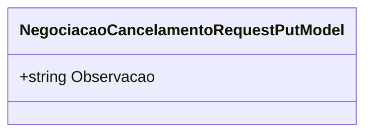

# NegociacaoCancelamentoRequestPutModel
**Namespace**: IsthmusWinthor.Dominio.Model.Verbas  
**Nome do Arquivo**: NegociacaoCancelamentoRequestPutModel.cs  

Esta classe é um DTO que transporta dados relacionados ao cancelamento de negociações.  

### Tipos Auxiliares e Dependências
Esta classe não possui tipos auxiliares ou enums associados.  

### Diagramas

---
Gerada em 29/12/2025 21:21:25
