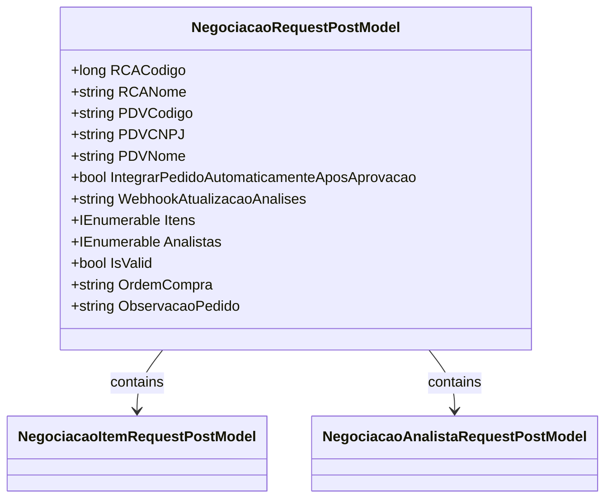

# NegociacaoRequestPostModel
**Namespace**: IsthmusWinthor.Dominio.Model.Verbas  
**Nome do Arquivo**: NegociacaoRequestPostModel.cs  

## Visão Geral e Responsabilidade
A classe `NegociacaoRequestPostModel` representa um modelo de solicitação para a negociação, contendo informações relevantes para a criação e validação de um pedido. O propósito desta classe é garantir que todos os dados necessários para a negociação estejam presentes e válidos antes de serem processados, assegurando que a negociação atenda a requisitos específicos de negócio.

## Métodos de Negócio

### Título: IsValid (Propriedade)
- **Objetivo**: Garante que os dados da negociação estejam completos e corretos antes de serem aceitos para processamento.
- **Comportamento**: 
  1. Verifica se `RCACodigo` é maior que zero.
  2. Confirma que `RCANome`, `PDVCodigo`, `PDVCNPJ` e `PDVNome` tenham valores não vazios e não consistam apenas em espaços em branco.
  3. Avalia se pelo menos um item na lista `Itens` possui um `PercentualAlteracaoPreco` maior que zero.
  4. Verifica se pelo menos um analista na lista `Analistas` possui um `Identificador` não vazio e um `PercentualDaVerba` maior que zero.
  5. Assegura que a soma dos percentuais dos analistas seja exatamente igual a 100, usando uma operação de arredondamento.
- **Retorno**: Retorna um valor booleano indicando se a negociação é válida (true) ou não (false).

## Propriedades Calculadas e de Validação
- **IsValid**: Esta propriedade calcula a validade do modelo com base em diversos critérios. O modelo é considerado válido se todos os requisitos citados acima forem atendidos.

## Navigations Property
- [NegociacaoItemRequestPostModel](NegociacaoItemRequestPostModel.md)
- [NegociacaoAnalistaRequestPostModel](NegociacaoAnalistaRequestPostModel.md)

## Tipos Auxiliares e Dependências
- [NegociacaoItemRequestPostModel](NegociacaoItemRequestPostModel.md)
- [NegociacaoAnalistaRequestPostModel](NegociacaoAnalistaRequestPostModel.md)

## Diagrama de Relacionamentos

---
Gerada em 29/12/2025 21:21:47
