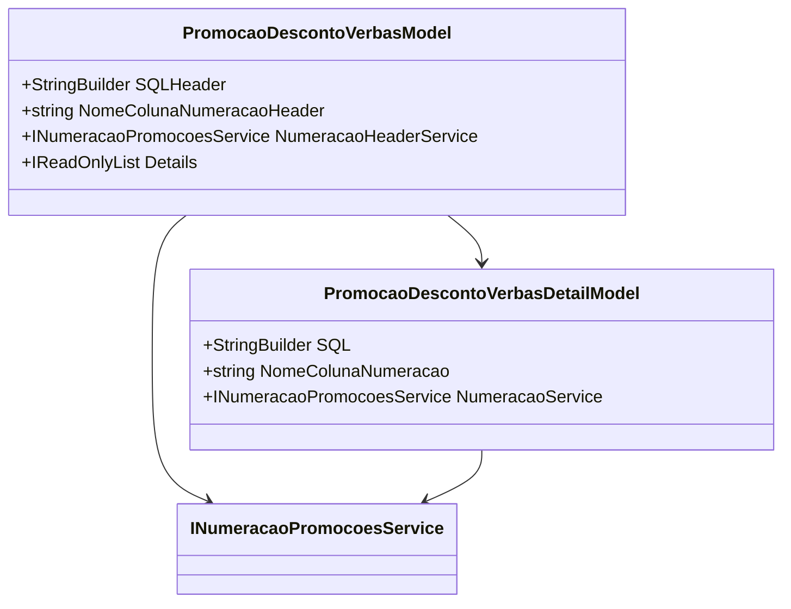

# PromocaoDescontoVerbasModel
**Namespace**: IsthmusWinthor.Dominio.Model.Verbas  
**Nome do Arquivo**: PromocaoDescontoVerbasModel.cs  

## Visão Geral e Responsabilidade
A classe `PromocaoDescontoVerbasModel` atua como um modelo representativo das promoções de desconto em verbas. Ela agrega detalhes sobre as promoções e gerencia as restrições SQL aplicáveis, garantindo que a estrutura dos dados respeite as regras de negócios relacionadas à promoção de descontos, facilitando a manipulação e a consulta dessas informações.

## Métodos de Negócio

### Título: `AdicionarDetail` - `public`
- **Objetivo**: Garante que detalhes de promoções de desconto sejam adicionados à lista interna de detalhes da promoção.
- **Comportamento**:
  1. Recebe um objeto do tipo `PromocaoDescontoVerbasDetailModel`.
  2. Adiciona o detalhe recebido à coleção interna `_details`.
- **Retorno**: Este método não retorna valor. 

## Propriedades Calculadas e de Validação
- **Restricoes**: 
  - Esta propriedade retorna uma lista somente leitura das restrições SQL acumuladas. A lógica de retorno garante que as restrições estejam acessíveis, mas não mutáveis desde fora da classe.
  
## Navigations Property
- **Details**: Esta propriedade mantém uma coleção de detalhes de promoção. O link para sua classe correspondente é: 
  - `[PromocaoDescontoVerbasDetailModel](PromocaoDescontoVerbasDetailModel.md)`

## Tipos Auxiliares e Dependências
- A classe `PromocaoDescontoVerbasModel` utiliza:
  - `[INumeracaoPromocoesService](INumeracaoPromocoesService.md)`: Interface utilizada para a numeracao de promoções.
- A classe `PromocaoDescontoVerbasDetailModel` é utilizada como um detalhe:
  - `[PromocaoDescontoVerbasDetailModel](PromocaoDescontoVerbasDetailModel.md)`

## Diagrama de Relacionamentos

