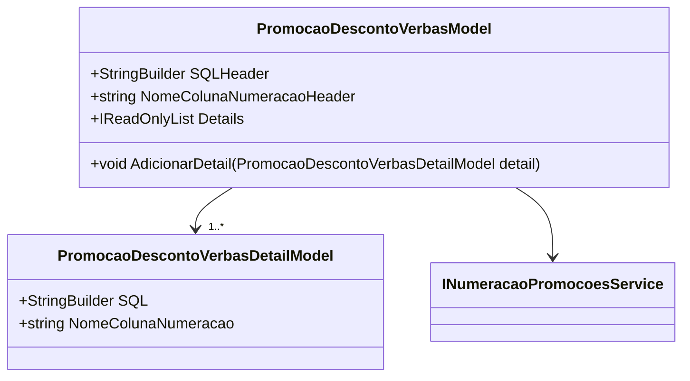

# PromocaoDescontoVerbasModel
- **Namespace**: IsthmusWinthor.Dominio.Model.Verbas
- **Nome do Arquivo**: PromocaoDescontoVerbasModel.cs

## Visão Geral e Responsabilidade
A classe `PromocaoDescontoVerbasModel` atua como uma estrutura para gerenciar e armazenar informações relacionadas a promoções de desconto sobre verbas. Ela agrega detalhes de promoções que incluem uma lista de restrições SQL associadas a cada promoção, garantindo que a execução correta das regras de negócio seja facilitada através da construção e manipulação de instruções SQL. Esta classe resolve o problema de gestão e organização das promoções, permitindo que os negócios estipulem critérios para concessão de descontos de maneira eficiente.

## Métodos de Negócio

### Título: AdicionarDetail (public)
- **Objetivo**: Este método garante que detalhes de promoção possam ser adicionados à lista de promoções, mantendo a integridade da coleção de `Details`.
- **Comportamento**: 
  1. Recebe uma instância de `PromocaoDescontoVerbasDetailModel`.
  2. Adiciona o detalhe fornecido à lista interna `_details`.
- **Retorno**: Este método não retorna nenhum valor, mas altera o estado interno da coleção de detalhes.

## Propriedades Calculadas e de Validação
A classe não possui propriedades que implementam lógica de validação ou cálculo no `get` ou `set`.

## Navigations Property
- [PromocaoDescontoVerbasDetailModel](PromocaoDescontoVerbasDetailModel.md): Representa detalhes de promoções de desconto.

## Tipos Auxiliares e Dependências
- [INumeracaoPromocoesService](INumeracaoPromocoesService.md): Interface utilizada para obter a numeração das promoções.
  
## Diagrama de Relacionamentos

---

# PromocaoDescontoVerbasDetailModel
- **Namespace**: IsthmusWinthor.Dominio.Model.Verbas
- **Nome do Arquivo**: PromocaoDescontoVerbasDetailModel.cs

Este modelo serve como um objeto de transporte para detalhamentos de promoções de desconto, mantendo informações cruciais como a consulta SQL e referências a serviços de numeração.
---
Gerada em 29/12/2025 21:22:10
