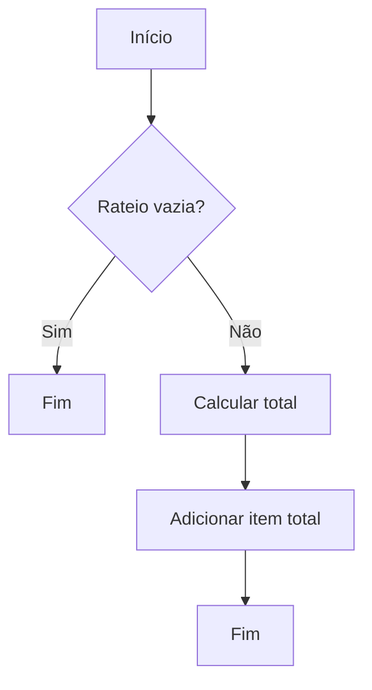

# NegociacaoAnalistaResponseModel
**Namespace**: IsthmusWinthor.Dominio.Model.Verbas.Responses  
**Nome do Arquivo**: NegociacaoAnalistaResponseModel.cs  

## Visão Geral e Responsabilidade
A classe `NegociacaoAnalistaResponseModel` serve como um modelo para transportar dados relacionados a uma negociação analisada por um analista. Ela encapsula informações sobre o estado da análise da negociação, incluindo o perfil do analista, status da negociação e uma lista de itens relacionados. Esta classe é fundamental para garantir que as informações apresentadas nas interfaces estejam devidamente alinhadas com a lógica das negociações analisadas.

## Métodos de Negócio

### TotalizarRateio
- **Visibilidade**: Public
- **Objetivo**: Este método garante que o total do rateio seja calculado e adicionado à lista de rateios.
- **Comportamento**:
  1. Verifica se a lista `Rateio` contém itens.
  2. Se a lista estiver vazia, o método retorna sem fazer alterações.
  3. Se houver itens, calcula o total somando os valores de `ValorRateio` de cada item na lista `Rateio`.
  4. Adiciona um novo `NegociacaoItemAnalistaResponseModel` à lista, contendo o código `0`, a descrição "Total", e o valor total calculado.
- **Retorno**: Este método não retorna nenhum valor, mas altera o estado interno da lista de rateios ao adicionar um item totalizador.



## Propriedades Calculadas e de Validação
- **DescricaoStatusAnalise**: 
   - Esta propriedade calculada retorna a descrição do status de análise utilizando a descrição auxiliar `UtilEnumDescription.Description`, que busca um valor legível a partir do enumerador `StatusNegociacaoVerba`. Isso garante que a interface mostre uma representação amigável do status da negociação.

## Navigations Property
- **Rateio**: 
   - Lista de itens de rateio, que é uma coleção de objetos do tipo [NegociacaoItemAnalistaResponseModel](NegociacaoItemAnalistaResponseModel.md).

## Tipos Auxiliares e Dependências
- **PerfilAnalistaEnum**: 
   - Enum que define os diferentes perfis de analistas.
- **StatusNegociacaoVerba**: 
   - Enum que representa os status possíveis de uma negociação.
- **UtilEnumDescription**: 
   - Classe estática utilizada para converter enums em suas representações descritivas.

## Diagrama de Relacionamentos
```mermaid
classDiagram
    class NegociacaoAnalistaResponseModel {
        +string Identificador
        +PerfilAnalistaEnum Perfil
        +string DescricaoPerfil
        +string Nome
        +StatusNegociacaoVerba StatusAnalise
        +decimal PercentualPagamento
        +decimal ValorPagamento
        +DateTime DataResposta
        +string Resposta
        +List<NegociacaoItemAnalistaResponseModel> Rateio
        +TotalizarRateio()
    }

    class NegociacaoItemAnalistaResponseModel {
        +int Codigo
        +string Descricao
        +decimal ValorRateio
    }

    enum PerfilAnalistaEnum {
        // Enum values
    }

    enum StatusNegociacaoVerba {
        // Enum values
    }

    NegociacaoAnalistaResponseModel "1" --> "0..*" NegociacaoItemAnalistaResponseModel
    NegociacaoAnalistaResponseModel --> PerfilAnalistaEnum
    NegociacaoAnalistaResponseModel --> StatusNegociacaoVerba
```
---
Gerada em 29/12/2025 21:26:24
