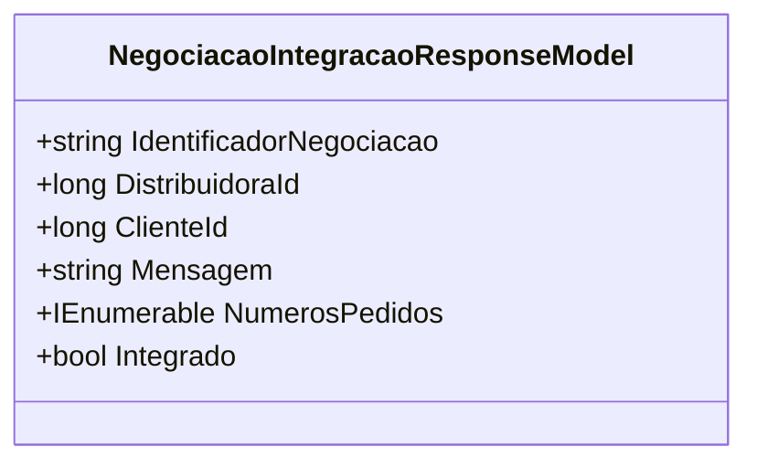

# NegociacaoIntegracaoResponseModel
**Namespace**: IsthmusWinthor.Dominio.Model.Verbas.Responses  
**Nome do Arquivo**: NegociacaoIntegracaoResponseModel.cs  

## Visão Geral e Responsabilidade
A classe `NegociacaoIntegracaoResponseModel` atua como um contêiner de dados para representar os resultados de uma negociação de integração entre um cliente e uma distribuidora. Essa classe é responsável por transportar informações essenciais sobre a negociação, como um identificador único, IDs relacionados ao cliente e distribuidora, uma mensagem associada e uma coleção de números de pedidos. O problema de negócio que essa classe resolve é a necessidade de um modelo estruturado para a comunicação de dados entre sistemas, assegurando que todas as informações relevantes sobre uma negociação de integração sejam facilmente acessíveis e manejáveis.

## Métodos de Negócio
### Título: Integrado (Public)
- **Objetivo**: Garante se a negociação está integrada com base na existência de números de pedidos.
- **Comportamento**: 
  1. Verifica se a propriedade `NumerosPedidos` não é nula e se contém pelo menos um item.
  2. Retorna `true` se existir ao menos um número de pedido, caso contrário, retorna `false`.
- **Retorno**: O valor retornado indica se a negociação foi bem-sucedida em relação à integração, baseado na presença de números de pedidos.

## Propriedades Calculadas e de Validação
### Integrado
- **Regra**: A propriedade `Integrado` é uma verificação calculada que determina se existem números de pedidos associados à negociação. Esta lógica é crucial para identificar rapidamente se a negociação foi integrada com sucesso, permitindo que outros processos do sistema possam se basear nessa informação.

## Navigations Property
- Nenhuma propriedade de navegação complexa foi identificada nesta classe.

## Tipos Auxiliares e Dependências
- **Dependências**: 
  - `IEnumerable<long>` - Utilizado para representar a coleção de números de pedidos.
  
Não há Enums ou Classes Estáticas/Helpers diretas associadas a esta classe.

## Diagrama de Relacionamentos

---
Gerada em 29/12/2025 21:26:38
