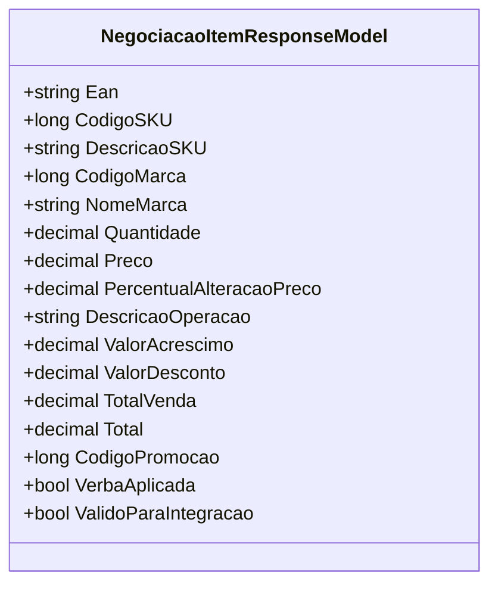

# NegociacaoItemResponseModel
**Namespace**: IsthmusWinthor.Dominio.Model.Verbas.Responses  
**Nome do Arquivo**: NegociacaoItemResponseModel.cs  

## Visão Geral e Responsabilidade
A classe `NegociacaoItemResponseModel` atua como um modelo de resposta para a negociação de itens, transportando dados relevantes sobre produtos em negociações comerciais. Ela é projetada para encapsular informações sobre o SKU, marca, preço e outras características que impactam as operações de venda, especialmente no que diz respeito ao contexto de aplicação de verbas e promoções.

## Métodos de Negócio
- **Título**: ValidoParaIntegracao (propriedade)
  - **Objetivo**: Garante que um item só é considerado válido para integração se não tiver uma verba aplicada ou se tiver uma promoção associada a ele.
  - **Comportamento**: 
    1. Verifica se a propriedade `VerbaAplicada` é verdadeira.
    2. Se `VerbaAplicada` for falsa, retorna `true`.
    3. Se `VerbaAplicada` for verdadeira, verifica se `CodigoPromocao` é maior que 0.
    4. Retorna `true` se `CodigoPromocao` for maior que 0; caso contrário, retorna `false`.
  - **Retorno**: Retorna um valor booleano que indica se o item pode ser integrado ou não.

- **Título**: VerbaAplicada (propriedade)
  - **Objetivo**: Indica se uma verba foi aplicada ao item com base nas alterações de preço.
  - **Comportamento**: 
    1. Avalia se o `PercentualAlteracaoPreco` é maior ou igual a zero.
    2. Se for, a verba é considerada aplicada (retorna `true`); caso contrário, não foi aplicada (retorna `false`).
  - **Retorno**: Retorna um valor booleano que indica a aplicação ou não de verba ao item.

## Propriedades Calculadas e de Validação
- **VerbaAplicada**: Calculada a partir do `PercentualAlteracaoPreco`, garantindo que se o preço tiver aumentado ou permanecido o mesmo, a verba está aplicada.
- **ValidoParaIntegracao**: Valida se um item deve ser integrado ao sistema com base na aplicação de verbas e na existência de promoções.

## Navigation Property
- Nenhuma propriedade navegação complexa encontrada nesta classe.

## Tipos Auxiliares e Dependências
- Nenhum enumerador ou classe auxiliar foi identificado como dependência da classe.

## Diagrama de Relacionamentos

---
Gerada em 29/12/2025 21:26:56
