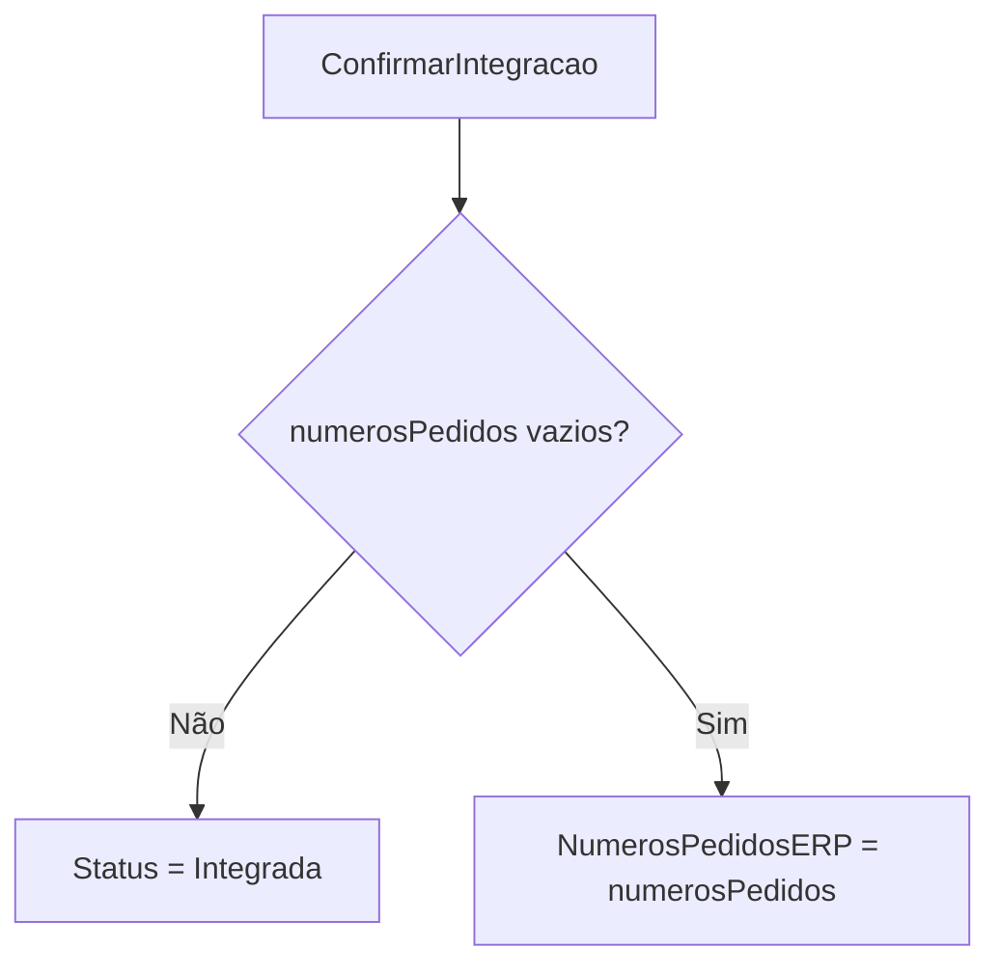
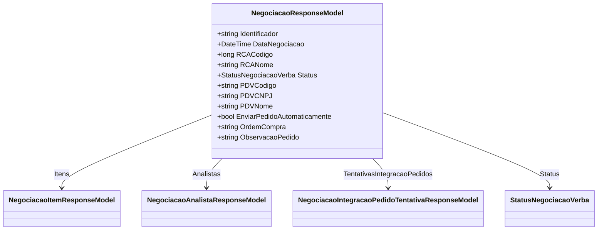

# NegociacaoResponseModel
- **Namespace**: IsthmusWinthor.Dominio.Model.Verbas.Responses
- **Nome do Arquivo**: NegociacaoResponseModel.cs

## Visão Geral e Responsabilidade
A classe `NegociacaoResponseModel` é responsável por representar a resposta de uma negociação, encapsulando os dados pertinentes a uma transação de negócio e sua integração com o sistema ERP. Ela garante que a lógica necessária para o gerenciamento do estado da negociação e a validação das informações sejam mantidas, assegurando a integridade dos dados durante o fluxo de trabalho.

## Métodos de Negócio

### AtualizarDadosParaIntegracaoDosDescontos
- **Título**: AtualizarDadosParaIntegracaoDosDescontos (public)
- **Objetivo**: Garante que os itens da negociação sejam atualizados com as informações corretas de desconto antes da integração.
- **Comportamento**:
  1. Para cada desconto na coleção de descontos, tenta encontrar o item correspondente na lista `Itens` usando o código do produto.
  2. Se o item correspondente for encontrado, o código de promoção do item é atualizado com o código de promoção do desconto.
- **Retorno**: Este método não retorna nada, mas atualiza o estado interno dos itens na negociação.

### DefinirEnvioDoPedidoAutomaticamenteAposIntegracao
- **Título**: DefinirEnvioDoPedidoAutomaticamenteAposIntegracao (public)
- **Objetivo**: Permite que o sistema registre a decisão de enviar o pedido automaticamente após a integração dos dados.
- **Comportamento**:
  1. A propriedade `EnviarPedidoAutomaticamente` é atualizada de acordo com o parâmetro passado.
- **Retorno**: Não retorna nada, mas altera a configuração do envio automático.

### DefinirOrdemDeCompra
- **Título**: DefinirOrdemDeCompra (public)
- **Objetivo**: Define a ordem de compra associada à negociação.
- **Comportamento**:
  1. Atualiza a propriedade `OrdemCompra` do objeto com o valor fornecido.
- **Retorno**: Não retorna nada, apenas altera o estado interno.

### DefinirObservacaoDoPedido
- **Título**: DefinirObservacaoDoPedido (public)
- **Objetivo**: Define uma observação para o pedido de negociação.
- **Comportamento**:
  1. A propriedade `ObservacaoPedido` é atualizada com o valor passado.
- **Retorno**: Não retorna nada, apenas altera a propriedade observacional.

### ConfirmarIntegracao
- **Título**: ConfirmarIntegracao (public)
- **Objetivo**: Atualiza o status da negociação para 'Integrada' e registra os números dos pedidos integrados.
- **Comportamento**:
  1. Verifica se a lista de `numerosPedidos` não está vazia.
  2. Se contiver valores, altera o `Status` da negociação para `Integrada` e armazena os números dos pedidos na lista `NumerosPedidosERP`.
- **Retorno**: Não retorna nada; altera o status da negociação.

### AdicionarTentativaIntegracao
- **Título**: AdicionarTentativaIntegracao (public)
- **Objetivo**: Adiciona uma tentativa de integração a uma lista de tentativas, mantendo o histórico de tentativas.
- **Comportamento**:
  1. Se a lista de `TentativasIntegracaoPedidos` for nula, uma nova lista é criada.
  2. A tentativa de integração fornecida é adicionada à lista.
- **Retorno**: Não retorna nada; atualiza a lista de tentativas de integração.

## Propriedades Calculadas e de Validação

### DescricaoStatus
- Regra: Retorna uma descrição do status da negociação, incluindo o número de aprovações necessárias.
- Calculado com base no `Status` e na contagem de analistas que aprovaram a negociação.

### Integrado
- Regra: Indica se a negociação está integrada ao sistema ERP, verificando o status e a presença de números de pedidos.

### PodeSerIntegrada
- Regra: Verifica se a negociação está aprovada e não foi integrada, permitindo a integração.

### PodeSerCancelada
- Regra: Indica se a negociação pode ser cancelada, baseado no fato de não estar integrada.

## Navigations Property
- `Itens`: Represents a collection of `NegociacaoItemResponseModel` ([NegociacaoItemResponseModel](NegociacaoItemResponseModel.md)).
- `Analistas`: Represents a collection of `NegociacaoAnalistaResponseModel` ([NegociacaoAnalistaResponseModel](NegociacaoAnalistaResponseModel.md)).
- `TentativasIntegracaoPedidos`: Represents a list of `NegociacaoIntegracaoPedidoTentativaResponseModel` ([NegociacaoIntegracaoPedidoTentativaResponseModel](NegociacaoIntegracaoPedidoTentativaResponseModel.md)).

## Tipos Auxiliares e Dependências
- Enum: [StatusNegociacaoVerba](StatusNegociacaoVerba.md)
- Helpers: [UtilEnumDescription](UtilEnumDescription.md)

## Diagrama de Relacionamentos

Esta documentação resume claramente o comportamento da classe `NegociacaoResponseModel`, destacando suas regras de negócio, integridade de dados, métodos relevantes, e suas interconexões no contexto do sistema.
---
Gerada em 29/12/2025 21:27:28
