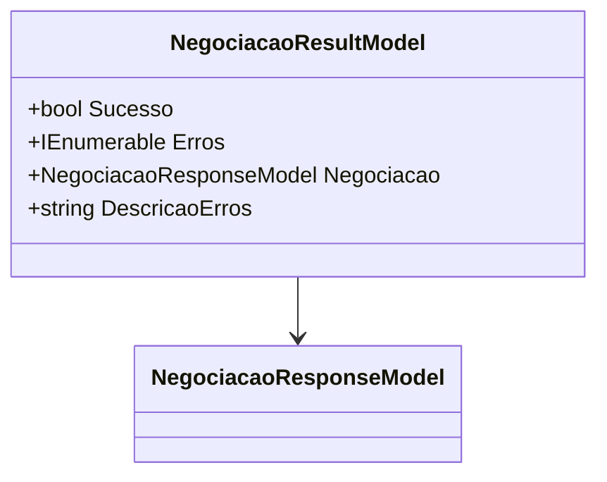

# NegociacaoResultModel
**Namespace**: IsthmusWinthor.Dominio.Model.Verbas.Responses  
**Nome do Arquivo**: NegociacaoResultModel.cs  

## Visão Geral e Responsabilidade
A classe `NegociacaoResultModel` serve como um objeto de retorno para operações de negociação, encapsulando os resultados de uma negociação realizada. Ela fornece informações sobre o sucesso da operação, detalhes dos erros, se houver, e a própria negociação, se disponível. O problema de negócio que ela resolve é o fornecimento de feedback estruturado para o cliente, permitindo que o usuário compreenda facilmente o resultado da operação.

## Métodos de Negócio

### Título: GetDescricaoErros (private)
- **Objetivo**: Este método garante que a descrição de todos os erros coletados seja formatada de maneira clara e legível.
- **Comportamento**: 
  1. Cria um `StringBuilder` para acumular as mensagens de erro.
  2. Itera sobre a coleção de erros.
  3. Para cada erro, adiciona-o como uma nova linha na string acumulada.
  4. Retorna a string contendo todos os erros formatados.
- **Retorno**: Retorna uma string que representa todos os erros concatenados, separados por quebras de linha.

## Propriedades Calculadas e de Validação

### Propriedades
- **DescricaoErros**: Esta propriedade retorna uma descrição formatada de todos os erros contidos na lista `Erros`. A regra por trás do cálculo é iterar sobre cada erro e concatená-los em uma única string, permitindo uma visualização consolidada dos problemas encontrados em uma operação.

## Navigations Property
- **Negociacao**: [NegociacaoResponseModel](NegociacaoResponseModel.md)

## Tipos Auxiliares e Dependências
- Não existem enumeradores ou classes auxiliares/Helpers utilizadas diretamente nesta classe.

## Diagrama de Relacionamentos

---
Gerada em 29/12/2025 21:27:39
