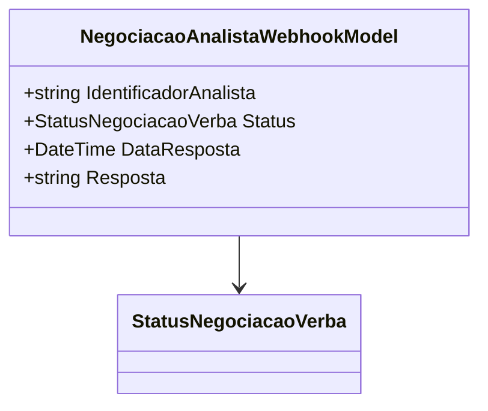

# NegociacaoAnalistaWebhookModel
**Namespace**: IsthmusWinthor.Dominio.Model.Verbas.Webhook  
**Nome do Arquivo**: NegociacaoAnalistaWebhookModel.cs

### Visão Geral e Responsabilidade
A classe `NegociacaoAnalistaWebhookModel` atua como um modelo de transporte de dados projetado para encapsular as informações necessárias sobre uma negociação realizadas por um analista através de webhooks. Seu papel é assegurar que os dados relevantes, como identificador do analista, status da negociação, data da resposta e a própria resposta, sejam transportados de forma consistente e estruturada entre as diferentes partes do sistema, facilitando assim o processamento e a resposta a eventos de negociação.

### Métodos de Negócio
Não há métodos que contenham lógica de negócio, pois a classe se trata de um modelo de transporte de dados (DTO).

### Propriedades Calculadas e de Validação
Não há propriedades calculadas ou validações associadas às propriedades desta classe.

### Navigations Property
Não existem propriedades que sejam classes complexas do domínio nesta classe.

### Tipos Auxiliares e Dependências
- Enumerador: `[StatusNegociacaoVerba](StatusNegociacaoVerba.md)`

### Diagrama de Relacionamentos

