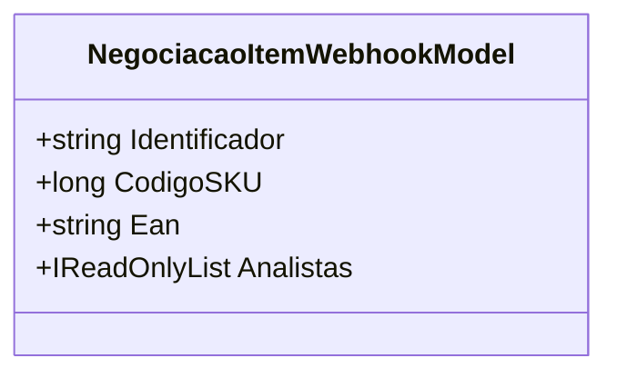

# NegociacaoItemWebhookModel
- **Namespace**: IsthmusWinthor.Dominio.Model.Verbas.Webhook
- **Nome do Arquivo**: NegociacaoItemWebhookModel.cs

> A classe `NegociacaoItemWebhookModel` serve como um Data Transfer Object (DTO) para transportar informações relacionadas a itens de negociação a partir de um evento de webhook.

### Tipos Auxiliares e Dependências
- Nenhum enumerador (Enum) ou classe estática/helper é utilizado nesta classe.

### Diagrama de Relacionamentos

