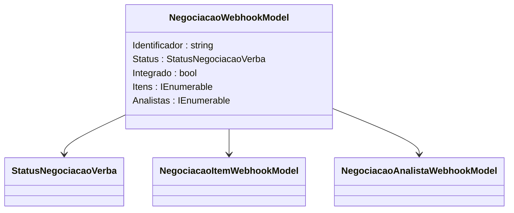

# NegociacaoWebhookModel
**Namespace**: IsthmusWinthor.Dominio.Model.Verbas.Webhook  
**Nome do Arquivo**: NegociacaoWebhookModel.cs  

## Visão Geral e Responsabilidade
A classe `NegociacaoWebhookModel` representa o modelo de dados utilizado para encapsular informações relacionadas a negociações de verbas recebidas via Webhook. Ela é responsável por transportar dados cruciais que descrevem o estado atual da negociação, incluindo um identificador único, seu status, se foi integrado e as listas de itens e analistas associados. Essa estrutura é vital para a comunicação de eventos em tempo real entre sistemas, facilitando a gestão e a rastreabilidade das negociações de verbas.

## Métodos de Negócio
- **Título**: `NegociacaoWebhookModel` (Construtor)
  - **Objetivo**: Garante que a inicialização de um objeto de negociação via Webhook inclua todos os dados necessários, assegurando que as negociações sejam devidamente registradas e compreendidas no sistema.
  - **Comportamento**: 
    1. Recebe parâmetros que representam as características da negociação.
    2. Inicializa as propriedades correspondentes com os valores fornecidos.
    3. Valida se os parâmetros atendem a condicionalidades (embora o código em si não implemente validações explicitas, espera-se que a construção de uma negociação sempre verifique se os dados estão corretos antes da construção).
  - **Retorno**: Não possui retorno, mas cria uma instância do modelo `NegociacaoWebhookModel` com as propriedades definidas.

## Propriedades Calculadas e de Validação
- Não existem propriedades que tenham lógica no `get` ou validação no `set`. Todas as propriedades são apenas leitura e são definidas no construtor.

## Navigation Property
- *Nenhuma propriedade que seja uma classe complexa do domínio foi identificada nesta classe.*

## Tipos Auxiliares e Dependências
- **Enums**:
  - [StatusNegociacaoVerba](StatusNegociacaoVerba.md)
  
- **Classes**:
  - [NegociacaoItemWebhookModel](NegociacaoItemWebhookModel.md)
  - [NegociacaoAnalistaWebhookModel](NegociacaoAnalistaWebhookModel.md)

## Diagrama de Relacionamentos

