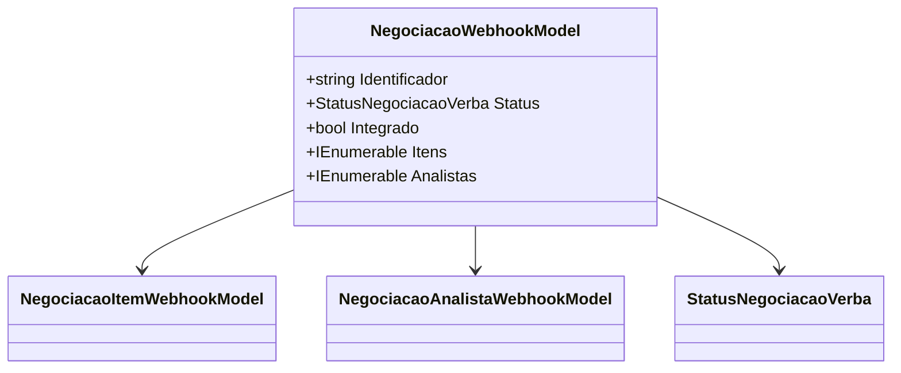

# NegociacaoWebhookModel
**Namespace**: IsthmusWinthor.Dominio.Model.Verbas.Webhook  
**Nome do Arquivo**: NegociacaoWebhookModel.cs  

NegociacaoWebhookModel é uma classe que serve como um modelo de dados para a negociação de verbas via Webhook, transportando informações sobre uma negociação específica, incluindo seu status, itens associados e analistas.

## Métodos de Negócio
- **Título**: Construtor Público
  - **Objetivo**: Agrupar e inicializar os atributos necessários para representar uma negociação através de Webhook.
  - **Comportamento**: O construtor recebe como parâmetros um identificador, status, uma indicação de integração, uma lista de itens de negociação e uma lista de analistas. Ele atribui esses valores às respectivas propriedades somente leitura.
  - **Retorno**: Não aplicável, pois é um construtor que inicializa a classe.

## Propriedades Calculadas e de Validação
Não existem propriedades calculadas ou com validações complexas, pois todas as propriedades são apenas getters.

## Navigation Property
- [NegociacaoItemWebhookModel](NegociacaoItemWebhookModel.md)
- [NegociacaoAnalistaWebhookModel](NegociacaoAnalistaWebhookModel.md)

## Tipos Auxiliares e Dependências
- [StatusNegociacaoVerba](StatusNegociacaoVerba.md)

## Diagrama de Relacionamentos

---
Gerada em 29/12/2025 21:28:00
