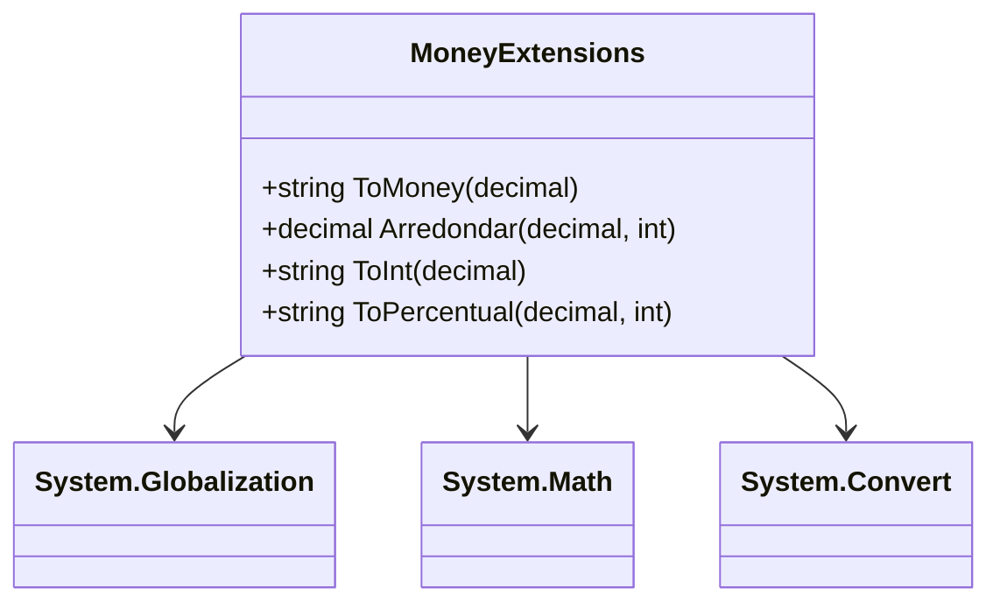

# MoneyExtensions

**Namespace**: IsthmusWinthor.Dominio  
**Nome do Arquivo**: MoneyExtensions.cs  

### Visão Geral e Responsabilidade
A classe `MoneyExtensions` é uma classe estática que oferece uma série de extensões úteis para manipulação e formatação de valores monetários e percentuais no contexto de aplicações financeiras. Esta classe visa facilitar operações comuns relacionadas a cálculos financeiros e apresentações numéricas, assegurando que a formatação esteja de acordo com a cultura "pt-BR" para moedas e oferecer funcionalidades convenientes como arredondamento e formatação percentual.

### Métodos de Negócio

#### ToMoney (Public)
- **Objetivo**: Formatar um valor decimal como moeda, garantindo que a exibição siga o padrão monetário brasileiro.
- **Comportamento**: Converte o valor decimal em uma string formatada como moeda com duas casas decimais, usando a cultura "pt-BR".
- **Retorno**: Retorna uma string que representa o valor formatado como moeda.

#### Arredondar (Public)
- **Objetivo**: Arredondar um valor decimal para um número específico de casas decimais.
- **Comportamento**: Utiliza o método `Math.Round` com arredondamento "AwayFromZero" para ajustar o valor à quantidade especificada de casas decimais.
- **Retorno**: Retorna um valor decimal arredondado com precisão definida pelo parâmetro `quantidadeCasas`.

#### ToInt (Public)
- **Objetivo**: Converter um valor decimal em uma representação inteira.
- **Comportamento**: Realiza uma conversão de um valor decimal para um inteiro e retorna sua representação em string.
- **Retorno**: Retorna uma string representando o número inteiro.

#### ToPercentual (Public)
- **Objetivo**: Apresentar um valor decimal como uma porcentagem formatada.
- **Comportamento**: Arredonda o valor para um número especificado de casas decimais. Se a precisão for zero, o valor é truncado antes da formatação como percentual.
- **Retorno**: Retorna uma string que representa o valor como percentual, incluindo o símbolo de percentual.

### Tipos Auxiliares e Dependências
- `System.Globalization` é utilizado para `CultureInfo`, assegurando que a formatação de moeda esteja de acordo com padrões culturais específicos.
- `System.Math` fornece operações matemáticas essenciais para arredondamento e truncamento de valores.
- Converter (`System.Convert`) para conversões de tipo de dados.

### Diagrama de Relacionamentos

