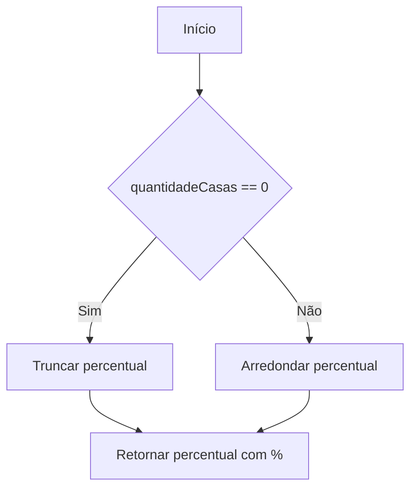
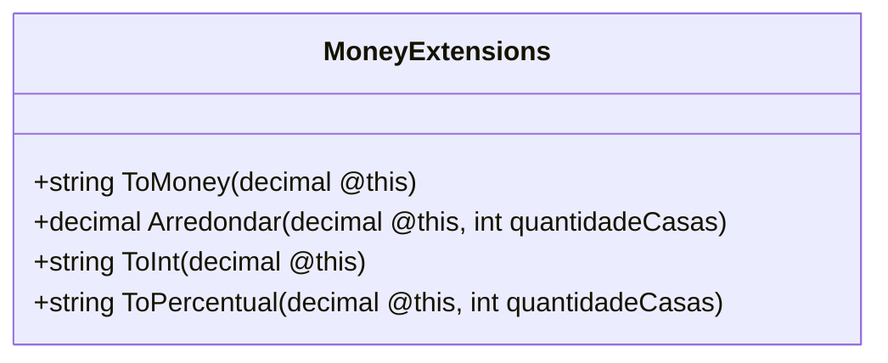

# MoneyExtensions

**Namespace**: IsthmusWinthor.Dominio  
**Nome do Arquivo**: MoneyExtensions.cs

## Visão Geral e Responsabilidade
A classe `MoneyExtensions` é uma classe de extensão estática que fornece métodos utilitários para manipulação e formatação de valores monetários e percentuais, além de oferecer funcionalidades adicionais como arredondamento e conversão para inteiro. Essa classe melhora a legibilidade e a praticidade dos cálculos financeiros, promovendo a consistência na apresentação de valores monetários em um formato padrão para a cultura brasileira.

## Métodos de Negócio

### 1. ToMoney() - Público
- **Objetivo**: Formatar um valor decimal para uma representação monetária no formato brasileiro.
- **Comportamento**: Este método converte o valor decimal em uma string formatada de acordo com a cultura específica do Brasil, utilizando o formato de moeda adequado.
- **Retorno**: Retorna uma string representando o valor em formato monetário (ex: R$ 1.234,56).

### 2. Arredondar() - Público
- **Objetivo**: Arredondar um valor decimal para um número específico de casas decimais.
- **Comportamento**: Este método utiliza a função `Math.Round`, especificando o modo de arredondamento para `AwayFromZero` e arredonda o valor para a quantidade de casas decimais definida pelo usuário.
- **Retorno**: Retorna um valor decimal arredondado de acordo com a quantidade de casas especificadas.

### 3. ToInt() - Público
- **Objetivo**: Converter um valor decimal para a representação de inteiro em forma de string.
- **Comportamento**: O método converte o valor decimal para um inteiro, eliminando a parte fracionária e retornando o valor como uma string.
- **Retorno**: Retorna uma string representando o valor como um número inteiro.

### 4. ToPercentual() - Público
- **Objetivo**: Converter um valor decimal em uma representação percentual, arredondando para uma quantidade específica de casas decimais.
- **Comportamento**: O método arredonda o valor para a quantidade de casas decimais especificada, e se `quantidadeCasas` for 0, ele trunca o valor. O resultado é formatado como uma string seguida pelo símbolo de porcentagem (%).
- **Retorno**: Retorna uma string representando o valor em porcentagem (ex: 85%).

## Propriedades Calculadas e de Validação
Não existem propriedades com lógica de cálculo ou validação nesta classe, pois todos os métodos são estáticos e não contêm propriedades.

## Navigation Properties
Não existem propriedades de navegação, pois esta é uma classe estática sem complexidade de domínio.

## Tipos Auxiliares e Dependências
- Nenhum enumerador ou classe auxiliar específica é utilizada nesta classe.

## Diagrama de Relacionamentos

---
Gerada em 29/12/2025 20:05:52
