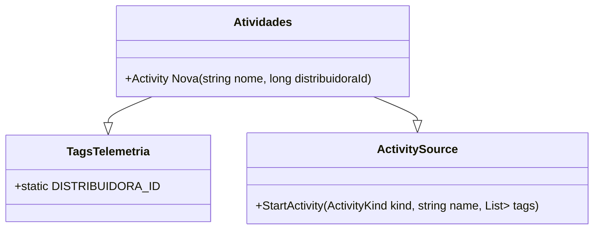

# Atividades
**Namespace**: IsthmusWinthor.Dominio.Monitoramentos  
**Nome do Arquivo**: Atividades.cs  

---

## Visão Geral e Responsabilidade
A classe `Atividades` é responsável por gerenciar atividades de monitoramento em uma aplicação. O principal objetivo é registrar atividades para monitoramento interno, correlacionando-as a uma distribuidora específica. Isso é fundamental para a coleta e análise de dados operacionais que ajudam a entender o desempenho e a saúde do sistema.

## Métodos de Negócio

### Título: Nova (public static)
- **Objetivo**: Criar uma nova atividade de monitoramento, atribuindo-a a um identificador de distribuidora. Isso garante que cada atividade esteja corretamente vinculada ao seu contexto de operação.
- **Comportamento**:
  1. Utiliza o `ActivitySource` para iniciar uma nova atividade do tipo interna (`ActivityKind.Internal`).
  2. Recebe como parâmetros o `nome` da atividade e o `distribuidoraId` para etiquetar a atividade.
  3. A nova atividade é criada com um conjunto de tags que inclui o ID da distribuidora.
  4. A atividade é então retornada para o chamador.
- **Retorno**: Retorna uma instância de `Activity` que representa a nova atividade criada.

## Propriedades Calculadas e de Validação
Não existem propriedades calculadas ou de validação nesta classe.

## Navigations Property
Não existem propriedades que representem classes complexas do domínio nesta classe.

## Tipos Auxiliares e Dependências
- **TagsTelemetria**: Classe usada para gerenciar as tags de telemetria relacionadas a distribuidoras.
- **ActivitySource**: Usado para a criação de novas atividades de monitoramento internas.

## Diagrama de Relacionamentos

---
Gerada em 29/12/2025 21:28:10
