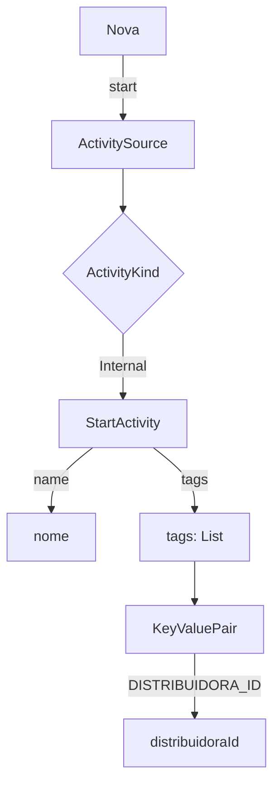
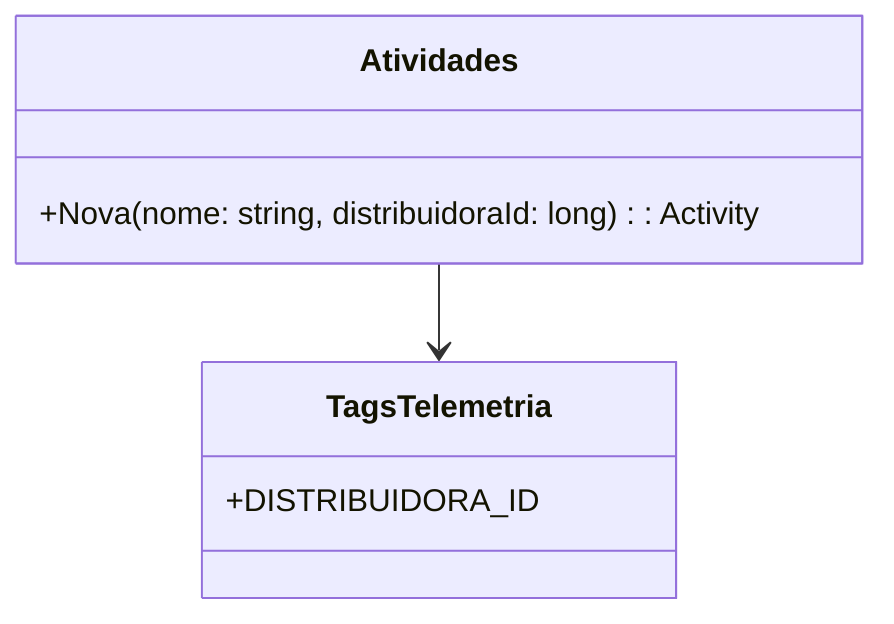

# Atividades
**Namespace**: IsthmusWinthor.Dominio.Monitoramentos  
**Nome do Arquivo**: Atividades.cs  

## Visão Geral e Responsabilidade
A classe `Atividades` atua como um facilitador para a criação e gerenciamento de atividades de monitoramento. O problema que ela resolve é a necessidade de rastreamento e análise de atividades internas dentro de uma aplicação, permitindo que desenvolvedores e operadores tenham visibilidade e insights sobre o comportamento do sistema. Ela centraliza a lógica necessária para iniciar novas atividades, garantindo que informações relevantes, como a ID da distribuidora, sejam registradas junto à atividade.

## Métodos de Negócio

### Título: Nova (Public)
**Objetivo:** Garante que uma nova atividade de monitoramento seja iniciada, acompanhando a ID da distribuidora como um dos parâmetros relevantes.  
**Comportamento:** Ao invocar o método `Nova`, a classe utiliza um `ActivitySource` pré-definido para iniciar uma nova `Activity`. O nome da atividade é passado como argumento, junto com uma lista de tags que incluem a ID da distribuidora. Essa operação é essencial para o rastreamento interno efetivo.  
**Retorno:** Retorna uma instância de `Activity` que representa a nova atividade iniciada; se a criação da atividade falhar, pode retornar nulo.

## Propriedades Calculadas e de Validação
Não existem propriedades calculadas ou de validação na classe `Atividades`, pois todas as funções provêm ações diretas relacionadas ao monitoramento de atividades.

## Navigations Property
Não existem Navigations Properties nesta classe, uma vez que ela é uma classe estática e se concentra na criação de atividades sem relacionamentos diretos.

## Tipos Auxiliares e Dependências
- `[TagsTelemetria](TagsTelemetria.md)`: Utilizada para fornecer tags de telemetria na inicialização das atividades.

## Diagrama de Relacionamentos

