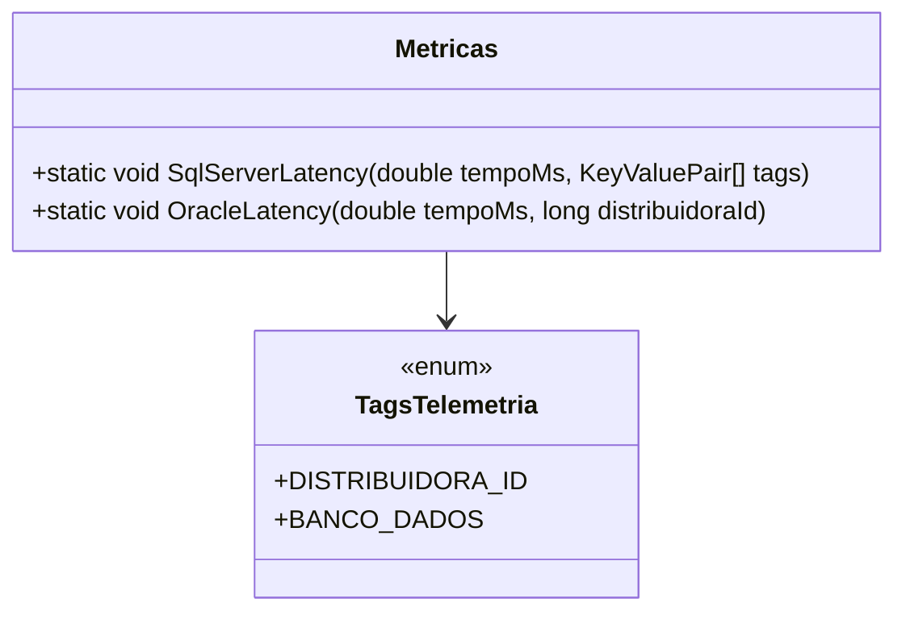

# Metricas
**Namespace**: IsthmusWinthor.Dominio.Monitoramentos  
**Nome do Arquivo**: Metricas.cs  

## Visão Geral e Responsabilidade
A classe `Metricas` é responsável por coletar e registrar métricas de desempenho para consultas em bancos de dados Oracle e SQL Server. O objetivo principal é monitorar o tempo de execução das queries, fornecendo dados que ajudam na análise de desempenho e na identificação de possíveis gargalos no sistema. A coleta dessas métricas é essencial para manter a eficiência e a responsividade das aplicações que interagem com os bancos de dados.

## Métodos de Negócio

### Método: `SqlServerLatency(double tempoMs, KeyValuePair<string, object>[] tags)`
- **Objetivo**: Garantir que o tempo de execução das consultas no SQL Server seja registrado corretamente.
- **Comportamento**: 
  1. O método aceita o tempo de execução em milissegundos (`tempoMs`) e um array de tags (`tags`) que podem conter informações adicionais sobre a consulta.
  2. Utiliza o histograma `_sqlQueryLatency` para registrar o tempo de execução, associando-o com as tags informadas.
- **Retorno**: Este método não retorna um valor. Ele apenas registra a métrica.

### Método: `OracleLatency(double tempoMs, long distribuidoraId)`
- **Objetivo**: Assegurar que o tempo de execução das consultas no banco de dados Oracle seja registrado junto com a identificação da distribuidora.
- **Comportamento**:
  1. O método aceita o tempo de execução em milissegundos (`tempoMs`) e a identificação da distribuidora (`distribuidoraId`).
  2. Registra o tempo de execução no histograma `_oracleQueryLatency`, utilizando o `distribuidoraId` e um identificador de banco de dados fixo ("oracle") como tags.
- **Retorno**: Este método não retorna um valor. Ele realiza um registro da métrica.

## Propriedades Calculadas e de Validação
Não existem propriedades com lógica de cálculo ou validação nesta classe.

## Navigations Property
Não existem propriedades que sejam classes complexas do domínio nesta classe.

## Tipos Auxiliares e Dependências
- Dependência: `TagsTelemetria` (betagens para telemetria).
  
### Links
- [TagsTelemetria](TagsTelemetria.md)

## Diagrama de Relacionamentos

---
Gerada em 29/12/2025 21:28:22
