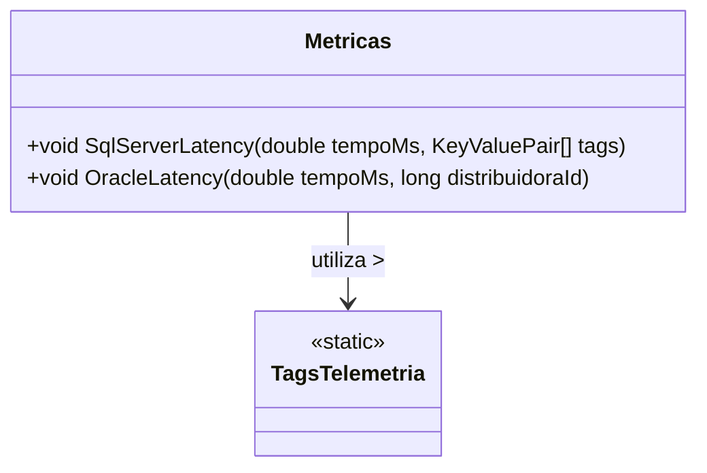

# Metricas
**Namespace**: IsthmusWinthor.Dominio.Monitoramentos  
**Nome do Arquivo**: Metricas.cs  

## Visão Geral e Responsabilidade
A classe `Metricas` serve como um coletor de métricas de desempenho, especificamente para medir a latência das consultas realizadas em bancos de dados Oracle e SQL Server. Ela garante que a aplicação possa monitorar e registrar o tempo de execução das queries, permitindo análises de performance e identificação de gargalos. Esta rastreabilidade é crucial para a otimização da aplicação, especialmente em cenários que exigem alta disponibilidade e eficiência.

## Métodos de Negócio

### SqlServerLatency (public)
- **Objetivo**: Registra a latência de consultas realizadas no SQL Server, garantindo que os desenvolvedores tenham dados sobre o desempenho dessas operações.
- **Comportamento**: 
  1. Chama o método `Record` do objeto `_sqlQueryLatency` para armazenar a latência.
  2. O tempo em milissegundos (`tempoMs`) e as tags relatas são passados como parâmetros.
  3. A latência é registrada junto com os dados adicionais fornecidos nas tags, permitindo uma análise mais diferenciada nas métricas.
- **Retorno**: Não retorna valor; o método é uma ação que integra dados de performance ao sistema de monitoramento.

### OracleLatency (public)
- **Objetivo**: Registra a latência de consultas feitas ao banco de dados Oracle, assegurando que informações críticas sobre performance estejam disponíveis.
- **Comportamento**:
  1. Chama o método `Record` do objeto `_oracleQueryLatency` para registrar a latência.
  2. O tempo em milissegundos (`tempoMs`) e um `KeyValuePair` contendo o ID da distribuidora e o tipo de banco de dados são passados como argumentos.
  3. A latência é armazenada com informações adicionais que permitem a segmentação por distribuidora e tipo de banco.
- **Retorno**: Não retorna valor; o método é uma ação que adiciona dados de monitoramento ao sistema.

## Propriedades Calculadas e de Validação
Nenhuma propriedade com lógica de cálculo ou validação foi identificada nesta classe.

## Navigations Property
Nenhuma propriedade complexa do domínio (navegação) foi identificada nesta classe.

## Tipos Auxiliares e Dependências
- `TagsTelemetria` - Classe estática que fornece tags predefinidas para Telemetria.

## Diagrama de Relacionamentos

