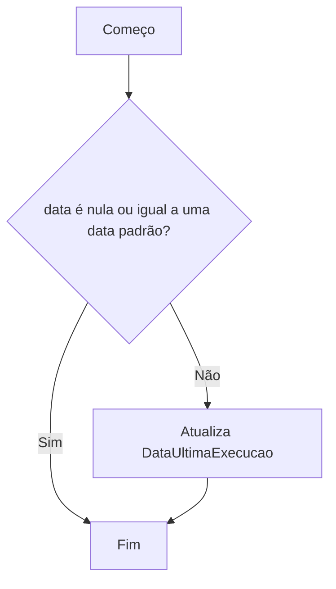
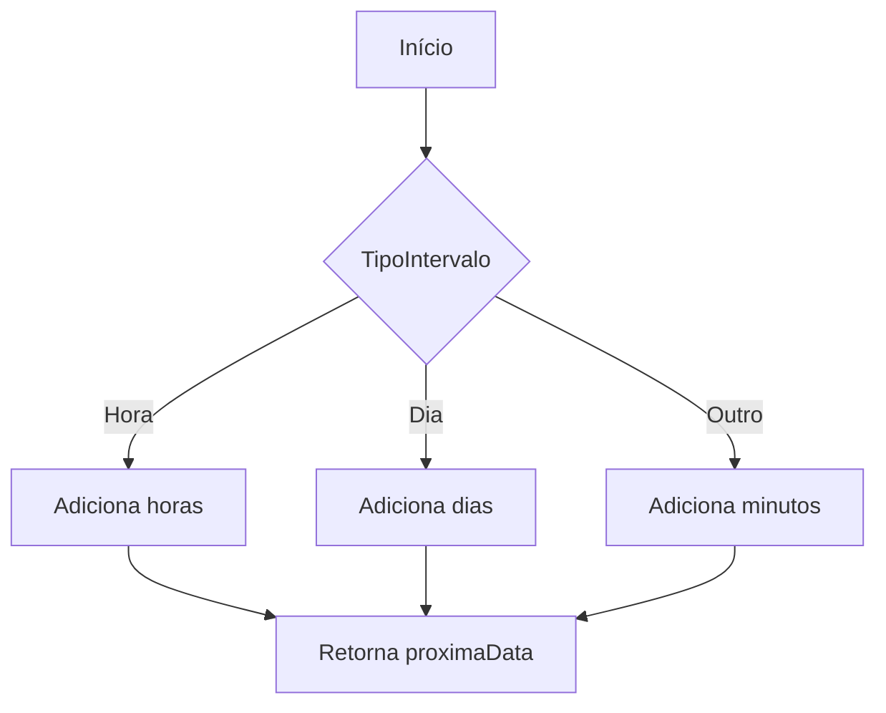
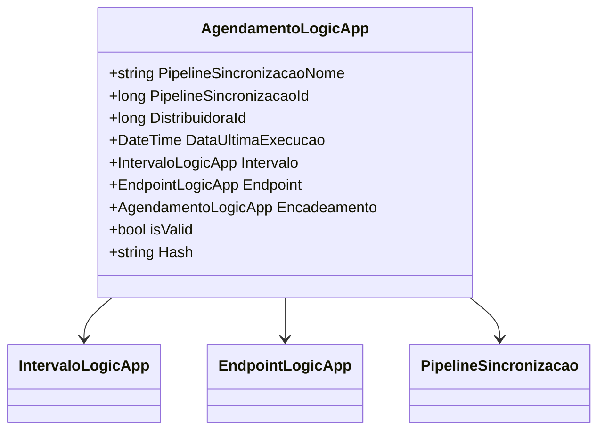

# AgendamentoLogicApp
**Namespace**: IsthmusWinthor.Dominio.POCO  
**Nome do Arquivo**: AgendamentoLogicApp.cs  

## Visão Geral e Responsabilidade
A classe `AgendamentoLogicApp` representa a lógica de agendamento de execuções de pipeline para uma distribuidora específica em um sistema corporativo. Ela é responsável por gerenciar o ciclo de vida das execuções programadas de forma a garantir que as execuções ocorram de acordo com as condições definidas, com base em intervalos e encadeamentos definidos por outros pipelines. Seu objetivo principal é assegurar que os agendamentos sejam válidos e oportune suas execuções de acordo com a lógica estabelecida.

## Métodos de Negócio

### AtualizarDataExecucao() - Público
- **Objetivo**: Atualiza a data da última execução para o momento atual.
- **Comportamento**: A data atual é obtida e atribuída à propriedade `DataUltimaExecucao`.
- **Retorno**: Este método não retorna valor.

### AtualizarDataExecucao(DateTime data) - Público
- **Objetivo**: Atualiza a data da última execução com uma data específica, desde que a data fornecida não seja nula e válida.
- **Comportamento**:
  1. Verifica se a `data` fornecida é nula ou igual a uma data padrão.
  2. Se não for, atualiza a propriedade `DataUltimaExecucao` com a data fornecida.
- **Retorno**: Este método não retorna valor.

### ObterProximaDataExecucao() - Público
- **Objetivo**: Retorna a próxima data agendada para execução, com base no tipo de agendamento configurado.
- **Comportamento**:
  1. Se o tipo de agendamento for `Intervalo`, chama o método privado `ProximaDataExecucaoIntervalo`.
  2. Caso contrário, calcula as datas de execução a partir dos horários de execução, garantindo que as datas obtidas sejam sempre futuras.
- **Retorno**: Retorna a próxima data de execução, ou `DateTime.MaxValue` caso não haja datas válidas.

### Key() - Público
- **Objetivo**: Gera a chave única para armazenar a configuração de agendamento no Redis.
- **Comportamento**: Chama o método auxiliar `RedisKeys.AgendamentoLogicApp` passando o `PipelineSincronizacaoId` e o `DistribuidoraId`.
- **Retorno**: Retorna uma string que representa a chave única no armazenamento de cache.

### AdicionarAgendamentoEncadeado(AgendamentoLogicApp agendamentoEncadeado) - Público
- **Objetivo**: Adiciona um agendamento encadeado, se este for válido.
- **Comportamento**: Verifica se o `agendamentoEncadeado` é válido e, se sim, atribui-o à propriedade `Encadeamento`.
- **Retorno**: Este método não retorna valor.

### ProximaDataExecucaoIntervalo() - Privado
- **Objetivo**: Calcula a próxima data de execução com base no intervalo definido.
- **Comportamento**: 
  1. Verifica o tipo de intervalo (hora, dia ou minuto).
  2. Adiciona o tempo correspondente à data da última execução, que é armazenada na propriedade `DataUltimaExecucao`.
- **Retorno**: Retorna a próxima data de execução.

## Propriedades Calculadas e de Validação

### isValid
- **Regra**: Esta propriedade computa se o agendamento é válido. Um agendamento é considerado válido se:
  1. O `DistribuidoraId` não pertence a uma lista específica de distribuidoras a serem ignoradas.
  2. O intervalo (`Intervalo`) e o endpoint (`Endpoint`) estão configurados corretamente, e o `Endpoint` também é válido.

### Hash
- **Regra**: Gera uma string representando a combinação do `PipelineSincronizacaoId` e `DistribuidoraId`, que pode ser usada como um identificador único para o agendamento.

## Navigations Property
- [IntervaloLogicApp](IntervaloLogicApp.md)
- [EndpointLogicApp](EndpointLogicApp.md)
- [PipelineSincronizacao](PipelineSincronizacao.md)

## Tipos Auxiliares e Dependências
- **Enumeradores**:
  - [TipoAgendamentoEnum](TipoAgendamentoEnum.md)
  - [TipoIntervaloEnum](TipoIntervaloEnum.md)
- **Classes Estáticas**:
  - [RedisKeys](RedisKeys.md)
  - [DateTimeUtil](DateTimeUtil.md)

## Diagrama de Relacionamentos

---
Gerada em 29/12/2025 21:28:50
