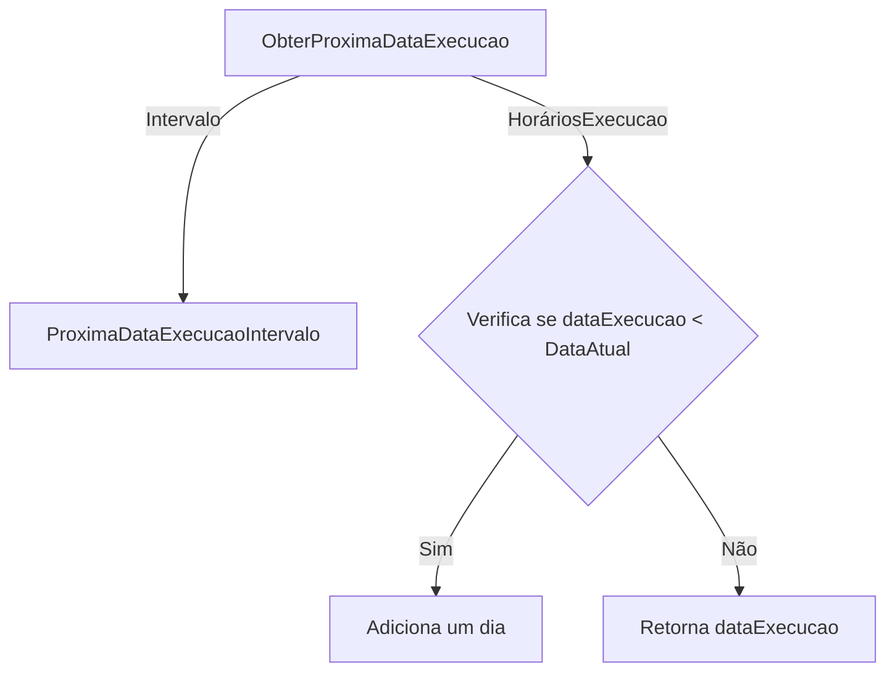
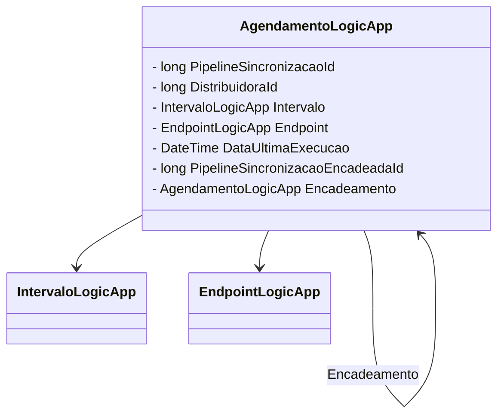

# AgendamentoLogicApp
**Namespace**: IsthmusWinthor.Dominio.POCO  
**Nome do Arquivo**: AgendamentoLogicApp.cs  

## Visão Geral e Responsabilidade
A classe `AgendamentoLogicApp` é responsável pela lógica de agendamentos associados a pipelines de sincronização. Ela gerencia a execução programada de processos para cada distribuidora, garantindo que as regras de negócio relacionadas ao intervalo de execução e condições de validado sejam cumpridas. O objetivo principal é permitir uma sincronização eficaz de dados entre distribuidoras, minimizando falhas e garantindo consistência na execução.

## Métodos de Negócio

### Método: AtualizarDataExecucao (public)
- **Objetivo**: Atualiza a data da última execução do agendamento.
- **Comportamento**: 
  1. Verifica se a data fornecida não é nula e não é uma data padrão.
  2. Se a validação for bem-sucedida, atualiza o valor da propriedade `DataUltimaExecucao` com a data passada.
- **Retorno**: Este método não possui retorno, mas atualiza o estado do objeto.

### Método: ObterProximaDataExecucao (public)
- **Objetivo**: Calcula a próxima data de execução com base no intervalo de agendamento.
- **Comportamento**: 
  1. Verifica o tipo de agendamento.
  2. Se o tipo for intervalo, chama o método `ProximaDataExecucaoIntervalo`.
  3. Caso contrário, itera sobre a lista de horários de execução.
     1. Para cada horário de execução, calcula a data e hora de execução conforme a data atual.
     2. Se a data resultante for anterior à data atual, adiciona um dia à data.
  4. Retorna a próxima data de execução ordenada ou `DateTime.MaxValue` se não houver horários definidos.
- **Retorno**: A próxima data válida de execução programada.

### Método: Key (public)
- **Objetivo**: Gera uma chave única utilizada no cache para identificação do agendamento.
- **Comportamento**:
  1. Chama o método estático `RedisKeys.AgendamentoLogicApp` passando o ID do pipeline e o ID da distribuidora.
- **Retorno**: Retorna a chave única como uma string.

### Método: AdicionarAgendamentoEncadeado (public)
- **Objetivo**: Associa um agendamento encadeado se for válido.
- **Comportamento**: 
  1. Verifica a validade do agendamento encadeado passado como parâmetro.
  2. Se o agendamento for válido, atribui à propriedade `Encadeamento`.
- **Retorno**: Este método não possui retorno, mas altera o estado do objeto.

### Método: ProximaDataExecucaoIntervalo (private)
- **Objetivo**: Determina a próxima data de execução com base no intervalo definido.
- **Comportamento**:
  1. Com base no tipo de intervalo, calcula a próxima data de execução.
     - Para horas, adiciona a quantidade especificada à data da última execução.
     - Para dias, faz a mesma operação, mas por dias.
     - Para outros tipos, adiciona minutos.
- **Retorno**: A próxima data de execução do tipo intervalo.

## Propriedades Calculadas e de Validação

### Propriedade: isValid
- A propriedade determina a validade do agendamento. É considerada válida se:
  - O ID da distribuidora não está na lista de distribuidoras a serem ignoradas.
  - O intervalo está definido.
  - O endpoint está definido e é válido.

### Propriedade: Hash
- Gera um hash composto pelo ID do pipeline de sincronização e o ID da distribuidora, fornecendo uma representação única para o objeto.

## Navigations Property
- `[IntervaloLogicApp](IntervaloLogicApp.md)` - Representa o intervalo de tempo associado ao agendamento.
- `[EndpointLogicApp](EndpointLogicApp.md)` - Representa o endpoint que será chamado durante o agendamento.
- `[AgendamentoLogicApp](AgendamentoLogicApp.md)` - Representa o agendamento encadeado, se existir.

## Tipos Auxiliares e Dependências
- `[TipoAgendamentoEnum](TipoAgendamentoEnum.md)` - Enum que define os tipos de agendamentos possíveis.
- `[TipoIntervaloEnum](TipoIntervaloEnum.md)` - Enum que define os tipos de intervalos possíveis.

## Diagrama de Relacionamentos

