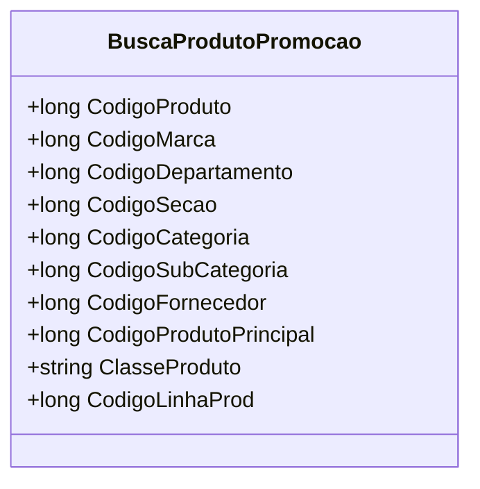

# BuscaProdutoPromocao
**Namespace**: IsthmusWinthor.Dominio.POCO  
**Nome do Arquivo**: BuscaProdutoPromocao.cs  

## Visão Geral e Responsabilidade
A classe `BuscaProdutoPromocao` representa um modelo de domínio utilizado para encapsular os dados referentes à busca de produtos em promoção. Ela resolve o problema de identificar e reunir informações relevantes sobre produtos promocionais, permitindo que outras partes do sistema acessem essas informações de maneira estruturada. Isso é fundamental para a realização de consultas e operações relacionadas a promoções de produtos.

## Métodos de Negócio

### 1. Método: Equals (public override)
- **Objetivo**: Assegura que dois objetos `BuscaProdutoPromocao` sejam considerados iguais quando todos os seus atributos relevantes são idênticos. Isso é importante para a coerência em operações que requerem a comparação de instâncias, como em coleções ou operações de pesquisa.
  
- **Comportamento**: 
  1. Verifica se o objeto comparado é do tipo `BuscaProdutoPromocao`.
  2. Compara cada uma das propriedades relevantes (`CodigoProduto`, `CodigoMarca`, `CodigoDepartamento`, etc.) entre os dois objetos.
  3. Retorna `true` se todos os valores forem iguais; caso contrário, retorna `false`.

- **Retorno**: 
  - Retorna um valor booleano (`true` ou `false`) que indica se o produto promocional comparado é equivalente ao objeto atual.

### 2. Método: GetHashCode (public override)
- **Objetivo**: Gera um código hash único para uma instância de `BuscaProdutoPromocao`, permitindo que objetos sejam usados como chaves em coleções que precisam de um acesso eficiente, como dicionários.
  
- **Comportamento**:
  1. Cria um novo objeto `HashCode`.
  2. Adiciona o valor de cada propriedade relevante ao hash.
  3. Retorna o valor do código hash gerado pelo objeto.

- **Retorno**: 
  - Retorna um inteiro que representa o código hash do objeto, usado para identificar de forma eficiente uma instância em coleções hash.

## Propriedades Calculadas e de Validação
- Não existem propriedades com lógica no `get` ou validação no `set`.

## Navigation Property
- Não existem propriedades que são classes complexas do domínio.

## Tipos Auxiliares e Dependências
- Não existem Enumeradores (Enums) ou Classes Estáticas/Helpers que a classe utiliza.

## Diagrama de Relacionamentos

---
Gerada em 29/12/2025 21:29:05
