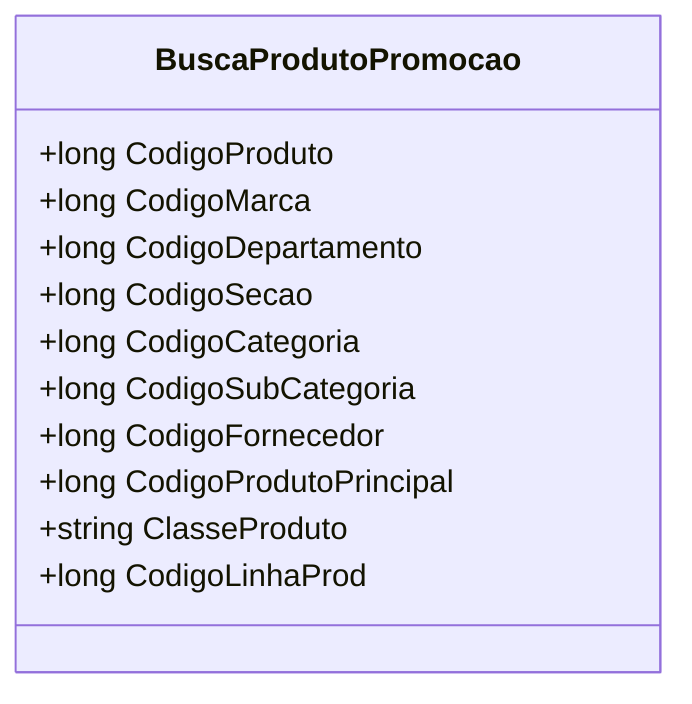

# BuscaProdutoPromocao
**Namespace**: IsthmusWinthor.Dominio.POCO  
**Nome do Arquivo**: BuscaProdutoPromocao.cs  

## Visão Geral e Responsabilidade
A classe `BuscaProdutoPromocao` é responsável por encapsular dados relacionados à busca de produtos em promoção dentro da aplicação. O objetivo principal é facilitar a transferência de informações necessárias para a execução de buscas complexas, garantindo que todos os detalhes relevantes sobre o produto, como categorias, marcas e fornecedores, sejam considerados na lógica de promoção.

## Métodos de Negócio
- **Título:** `Equals` (override)  
  **Objetivo:** Garante que duas instâncias de `BuscaProdutoPromocao` sejam consideradas iguais se seus códigos de produto, marcas, departamentos, seções, categorias, subcategorias, fornecedores, produtos principais, linhas de produtos e classe de produto forem idênticos, assegurando a integridade na comparação de objetos.  
  **Comportamento:** 
  1. Verifica se o objeto a ser comparado é da mesma classe `BuscaProdutoPromocao`.
  2. Compara todos os campos relevantes: `CodigoProduto`, `CodigoMarca`, `CodigoDepartamento`, `CodigoSecao`, `CodigoCategoria`, `CodigoSubCategoria`, `CodigoFornecedor`, `CodigoProdutoPrincipal`, `CodigoLinhaProd`, e `ClasseProduto`.
  3. Retorna `true` se todos os campos forem iguais; caso contrário, retorna `false`.  
  **Retorno:** Retorna um valor booleano (`true` ou `false`) que indica se os dois objetos são iguais.

- **Título:** `GetHashCode` (override)  
  **Objetivo:** Garante que cada instância tenha um código hash único baseado em suas propriedades, que é fundamental para a utilização correta em coleções que dependem de hashing, como dicionários e conjuntos.  
  **Comportamento:** 
  1. Cria uma nova instância de `HashCode`.
  2. Adiciona à instância de hash todos os campos relevantes.
  3. Retorna o código hash calculado.  
  **Retorno:** Retorna um valor inteiro que representa o código hash da instância. 

## Propriedades Calculadas e de Validação
Nenhuma propriedade na classe `BuscaProdutoPromocao` possui lógica de cálculo ou validação explícita no getter ou setter.

## Navigations Property
- Não há propriedades que representem classes complexas do domínio dentro de `BuscaProdutoPromocao`.

## Tipos Auxiliares e Dependências
- **Enumeradores e Class Helpers utilizados:**
  - Nenhum enumerador ou classe auxiliar está explicitamente associado a esta classe.

## Diagrama de Relacionamentos

A classe `BuscaProdutoPromocao` atua como um transporte de dados em cenários de busca de promoções, agregando informações críticas sobre produtos e sua categorização, sem qualquer lógica de negócio adicional ou simbiose com outras entidades complexas do domínio.
