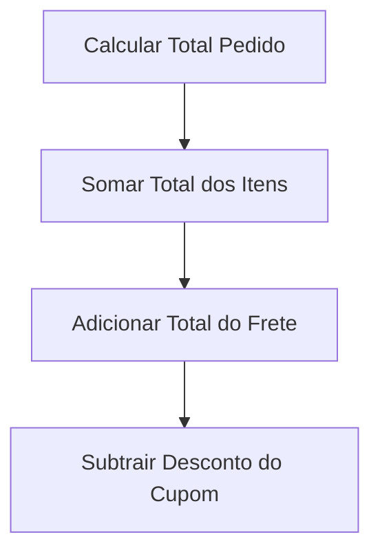
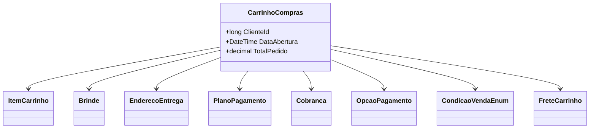

# CarrinhoCompras
**Namespace**: IsthmusWinthor.Dominio.POCO.Carrinho  
**Nome do Arquivo**: CarrinhoCompras.cs

## Visão Geral e Responsabilidade
A classe `CarrinhoCompras` representa o comportamento do carrinho de compras em um sistema de e-commerce. Ela encapsula toda a lógica de manipulação dos itens que o cliente deseja adquirir, além de gerenciar endereços de entrega, fretes, condições de venda e pagamento. Este modelo é crucial para garantir que as regras de negócio relacionadas ao carrinho sejam atendidas de forma válida, como aplicação de descontos, cálculo do total do pedido e gerenciamento de fretes.

## Métodos de Negócio

### Título: DefinirCondicaoVenda (public)
**Objetivo**: Garantir que a condição de venda atribuída ao carrinho esteja dentro do conjunto de condições válidas.  

**Comportamento**: 
1. Se `condicaoVenda` recebido for nulo, define como `Revenda`.
2. Verifica se a condição de venda é pertinente (não pode ser "Consumo" ou "Brinde").
3. Caso contrário, lança uma exceção informando que a condição de venda é inválida.

**Retorno**: Não há retorno, mas o estado interno do carrinho é atualizado.

### Título: ObterCondicaoVenda (public)
**Objetivo**: Retornar a condição de venda atual do carrinho, garantindo que ela não seja inconsistente.  

**Comportamento**: 
1. Se `CondicaoVenda` for nulo, define como `Revenda`.
2. Verifica se a condição é "Brinde".
3. Se sim, redefine para `Revenda` e lança uma exceção informando que a condição era inválida.

**Retorno**: Retorna a condição de venda válida.

### Título: CalcularTotalPedido (private)
**Objetivo**: Calcular o total do pedido com base nos itens do carrinho, considerando descontos e frete.  

**Comportamento**: 
1. Obtém a soma total dos itens do carrinho.
2. Adiciona o total do frete.
3. Subtrai o valor de desconto do cupom, se presente.

**Retorno**: Retorna o valor total calculado do pedido.

### Título: FretesValidar (public)
**Objetivo**: Validar e retornar a lista de fretes aplicáveis ao carrinho de acordo com as condições definidas.  

**Comportamento**:
1. Verifica se permite fretes por agrupamento.
2. Extrai identificadores de agrupamento dos itens do carrinho.
3. Para cada identificador, retorna um frete associado ou um frete nulo se não houver.

**Retorno**: Lista de objetos `FreteCarrinho` que representam os fretes válidos.

## Propriedades Calculadas e de Validação

### Propriedade: TotalPedido
**Regra**: Calcula o total do pedido somando os valores dos itens, frete e subtraindo os descontos. É uma propriedade de leitura.

### Propriedade: CarrinhoGeraCashBack
**Regra**: Verifica se algum item do carrinho gerou cashback, retornando `true` se há pelo menos um item que atingiu a campanha de cashback.

### Propriedade: TotalFrete
**Regra**: Calcula o total dos fretes inseridos no carrinho, somando os valores de cada frete.

## Navigation Property

- [ItemCarrinho](ItemCarrinho.md) - Representa um item no carrinho.
- [Brinde](Brinde.md) - Representa brindes aplicáveis ao carrinho.
- [EnderecoEntrega](EnderecoEntrega.md) - Representa o endereço de entrega vinculado ao carrinho.
- [PlanoPagamento](PlanoPagamento.md) - Representa as opções de planos de pagamento disponíveis.
- [Cobranca](Cobranca.md) - Representa os dados de cobrança associados ao pedido.

## Tipos Auxiliares e Dependências

- [CondicaoVendaEnum](CondicaoVendaEnum.md) - Enum que define as condições de venda aplicáveis a uma transação.
- [OpcaoPagamento](OpcaoPagamento.md) - Enum que define as opções de pagamento disponíveis.
- [FreteCarrinho](FreteCarrinho.md) - Representa um frete aplicável ao carrinho.

## Diagrama de Relacionamentos

---
Gerada em 29/12/2025 21:39:57
