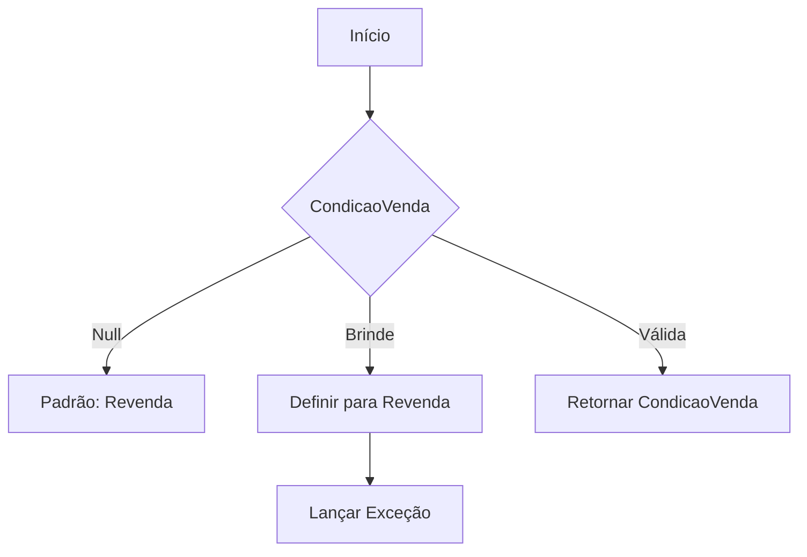
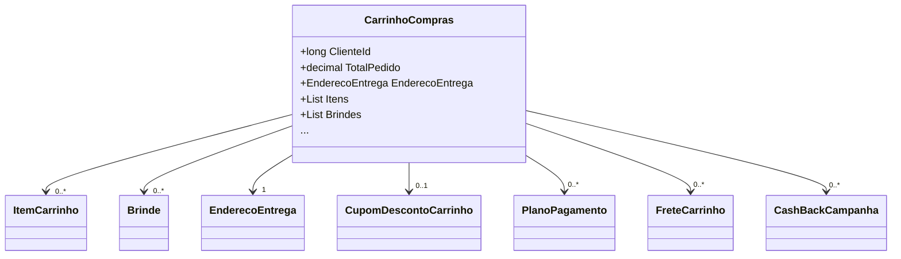

# CarrinhoCompras
**Namespace**: IsthmusWinthor.Dominio.POCO.Carrinho  
**Nome do Arquivo**: CarrinhoCompras.cs

## Visão Geral e Responsabilidade
A classe `CarrinhoCompras` representa o modelo de domínio do carrinho de compras de um cliente. Ela é responsável por gerenciar os itens que o cliente deseja comprar, aplicar descontos, calcular o total do pedido e validar condições de venda específicas. O modelo busca resolver o problema de controle e processamento de compras, permitindo o manejo de brindes, fretes e diferentes condições de pagamento.

## Métodos de Negócio

### 1. DefinirCondicaoVenda(CondicaoVendaEnum? condicaoVenda)
- **Objetivo**: Garantir que a condição de venda definida para um carrinho seja válida.
- **Comportamento**: 
  1. Recebe uma condição de venda.
  2. Se a condição for nula, define como padrão `Revenda`.
  3. Verifica se a nova condição é válida (somente `Consumo` ou `Revenda` são aceitas).
  4. Caso a condição fornecida seja inválida, lança uma exceção.
- **Retorno**: Não retorna valor.

### 2. ObterCondicaoVenda()
- **Objetivo**: Retornar a condição de venda atual do carrinho, assegurando que ela seja válida.
- **Comportamento**: 
  1. Obtém a condição de venda, ou utiliza `Revenda` como padrão se não estiver definida.
  2. Se a condição for `Brinde`, redefine para `Revenda` e lança uma exceção.
- **Retorno**: Um valor do tipo `CondicaoVendaEnum` representando a condição de venda.

### 3. PlanoPagamento(ItemCarrinho itemCarrinho)
- **Objetivo**: Encontrar e retornar o plano de pagamento associado a um item específico no carrinho.
- **Comportamento**: 
  1. Recebe um item de carrinho.
  2. Verifica se o item é nulo; se for, retorna nulo.
  3. Busca na lista de planos de pagamento associados ao carrinho, comparando o código do item.
- **Retorno**: Retorna um objeto `PlanoPagamento` correspondente ao item, ou nulo.

### 4. CalcularTotalPedido()
- **Objetivo**: Calcular o total do pedido com base nos itens, frete e descontos aplicados.
- **Comportamento**: 
  1. Soma os totais de todos os itens do carrinho.
  2. Adiciona o total de frete.
  3. Subtrai o valor do cupom de desconto, se presente.
- **Retorno**: Um valor decimal representando o total do pedido.

### 5. FretesValidar()
- **Objetivo**: Validar e retornar a lista de fretes disponíveis, considerando se fretes por agrupamento são permitidos.
- **Comportamento**: 
  1. Identifica agrupamentos de itens, dependendo da configuração de frete.
  2. Gera uma lista de objetos `FreteCarrinho` para cada agrupamento.
- **Retorno**: Uma lista de `FreteCarrinho` que contém fretes válidos para o carrinho.

## Propriedades Calculadas e de Validação

### 1. TotalPedido
- **Regra**: Calcula automaticamente o total do pedido ao acessar a propriedade `TotalPedido`, somando os itens, frete e aplicando qualquer desconto.

### 2. CarrinhoGeraCashBack
- **Regra**: Determina se o carrinho gera cashback verificando se algum item atingiu as condições de cashback.

## Navigations Property

- `[ItemCarrinho](ItemCarrinho.md)`
- `[Brinde](Brinde.md)`
- `[EnderecoEntrega](EnderecoEntrega.md)`
- `[CupomDescontoCarrinho](CupomDescontoCarrinho.md)`
- `[PlanoPagamento](PlanoPagamento.md)`
- `[FreteCarrinho](FreteCarrinho.md)`
- `[CashBackCampanha](CashBackCampanha.md)`

## Tipos Auxiliares e Dependências

- `[CondicaoVendaEnum](CondicaoVendaEnum.md)`
- `[OpcaoPagamento](OpcaoPagamento.md)`
- `[DadosPagamentoCartao](DadosPagamentoCartao.md)`
- `[PerfilLoginEnum](PerfilLoginEnum.md)`

## Diagrama de Relacionamentos

