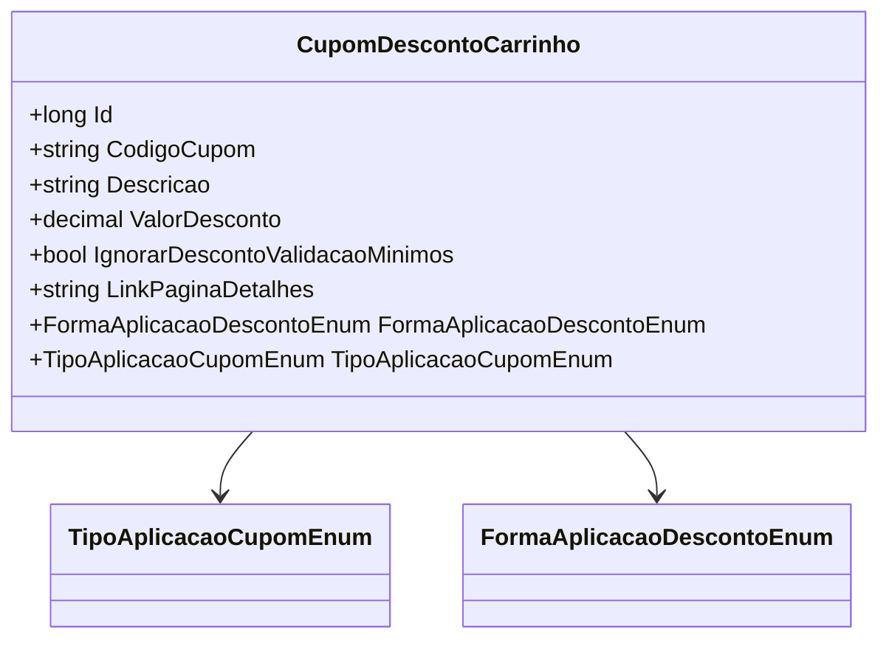

# CupomDescontoCarrinho
**Namespace**: IsthmusWinthor.Dominio.POCO.Carrinho  
**Nome do Arquivo**: CupomDescontoCarrinho.cs  

### Visão Geral e Responsabilidade
A classe `CupomDescontoCarrinho` representa um cupom de desconto que pode ser aplicado a um carrinho de compras. Esta classe é responsável por armazenar as informações do cupom, incluindo seu código, descrição, a forma de aplicação do desconto, e regras associadas ao desconto, como a possibilidade de ignorar validações de mínimo requerido. O problema de negócio que ela resolve é a aplicação efetiva de descontos em compras, proporcionando aos usuários uma experiência de compra mais atrativa.

### Métodos de Negócio
Atualmente, a classe `CupomDescontoCarrinho` não contém métodos com lógica complexa ou regras de negócio definidas, sendo composta por propriedades, conforme necessário para o transporte de dados relacionados a cupons.

### Propriedades Calculadas e de Validação
- **ValorDesconto**: Esta propriedade representa o valor total do desconto aplicado. Embora seu valor seja atualmente definido como 0.0m no construtor, ela deve ser calculada posteriormente com base na lógica de negócios ao aplicar o cupom ao carrinho.

### Navigations Property
- Nenhuma propriedade de navegação complexa (entidade) foi identificada nesta classe.

### Tipos Auxiliares e Dependências
- [TipoAplicacaoCupomEnum](TipoAplicacaoCupomEnum.md)
- [FormaAplicacaoDescontoEnum](FormaAplicacaoDescontoEnum.md)

### Diagrama de Relacionamentos

Esta documentação fornece uma visão geral clara da funcionalidade e propósito da classe `CupomDescontoCarrinho`, permitindo que stakeholders compreendam seu papel dentro do domínio da aplicação.
