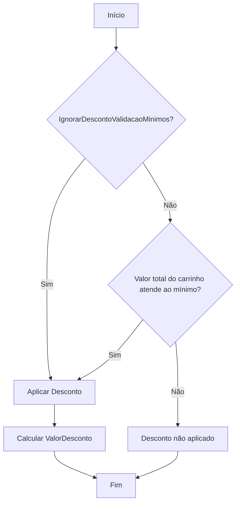
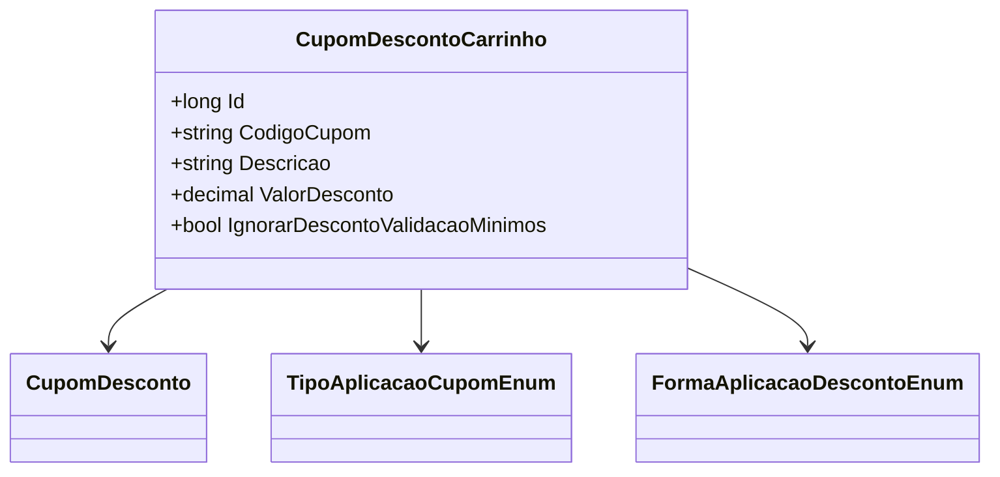

# CupomDescontoCarrinho
**Namespace**: IsthmusWinthor.Dominio.POCO.Carrinho  
**Nome do Arquivo**: CupomDescontoCarrinho.cs  

## Visão Geral e Responsabilidade
A classe `CupomDescontoCarrinho` representa a lógica de aplicação de descontos em um carrinho de compras. Sua principal responsabilidade é encapsular as informações de um cupom de desconto, incluindo sua aplicação e o cálculo do valor do desconto a ser aplicado. Essa classe ajuda na validação das regras de negócios relacionadas a cupons de desconto, facilitando a manipulação e a aplicação correta de descontos durante o processo de checkout.

## Métodos de Negócio
### AplicarDesconto
- **Título**: AplicarDesconto (Público)
- **Objetivo**: Garante que o desconto seja aplicado somente se os critérios necessários, como os mínimos de compra, forem atendidos.
- **Comportamento**:
  1. Verifica se `IgnorarDescontoValidacaoMinimos` está habilitado.
  2. Se não, valida se o valor total do carrinho atende aos requisitos mínimos para a aplicação do cupom.
  3. Se os critérios forem atendidos, calcula o valor total do desconto com base no tipo de aplicação e nas regras específicas definidas em `FormaAplicacaoDescontoEnum`.
  4. Atualiza a propriedade `ValorDesconto` com o valor calculado.
  

- **Retorno**: O método não retorna um valor diretamente, mas atualiza a propriedade `ValorDesconto` com o valor calculado ou permanece com o valor anterior se a validação falhar.

## Propriedades Calculadas e de Validação
- **ValorDesconto**: Este valor representa o desconto total que será aplicado. Seu cálculo depende das regras configuradas em `FormaAplicacaoDescontoEnum` e das condições de validade do cupom. Este valor pode ser ajustado dinamicamente, dependendo da aplicação das regras de negócio associadas.

## Navigation Property
- `CupomDesconto`: Classe complexa que está associada à proposta de desconto. Essa relação indica que `CupomDescontoCarrinho` depende de informações adicionais sobre o cupom de desconto.
  - [CupomDesconto](CupomDesconto.md)

## Tipos Auxiliares e Dependências
- **Enumeradores**:
  - [TipoAplicacaoCupomEnum](TipoAplicacaoCupomEnum.md)
  - [FormaAplicacaoDescontoEnum](FormaAplicacaoDescontoEnum.md)

## Diagrama de Relacionamentos

Essa documentação técnica resume as regras de negócio e as funcionalidades cruciais da classe `CupomDescontoCarrinho`, alinhando-se ao propósito de manter a integridade dos dados e à lógica de aplicação de descontos em um carrinho de compras.
---
Gerada em 29/12/2025 21:40:13
