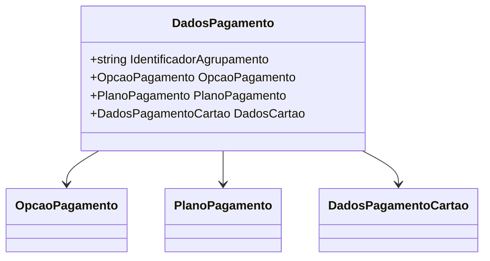

# DadosPagamento
**Namespace**: IsthmusWinthor.Dominio.POCO.Carrinho  
**Nome do Arquivo**: DadosPagamento.cs  

Esta classe representa um modelo de dados utilizado para transportar informações sobre a forma de pagamento em um sistema de e-commerce. 

### Propriedades
- **IdentificadorAgrupamento**: Um identificador único que agrupa os dados de pagamento.
- **OpcaoPagamento**: Uma instância da enumeração que define as opções de pagamento disponíveis.
- **PlanoPagamento**: Um objeto que contém informações relacionadas ao plano de pagamento escolhido.
- **DadosCartao**: Um objeto que encapsula dados específicos para pagamentos realizados por cartão.

### Tipos Auxiliares e Dependências
- **Enums e Classes Auxiliares**:
  - `[OpcaoPagamento](OpcaoPagamento.md)`: Enum que define as diferentes opções de pagamento.
  - `[PlanoPagamento](PlanoPagamento.md)`: Classe que contém informações sobre planos de pagamento.
  - `[DadosPagamentoCartao](DadosPagamentoCartao.md)`: Classe que contém os dados de cartão para pagamento.
  
### Diagrama de Relacionamentos

