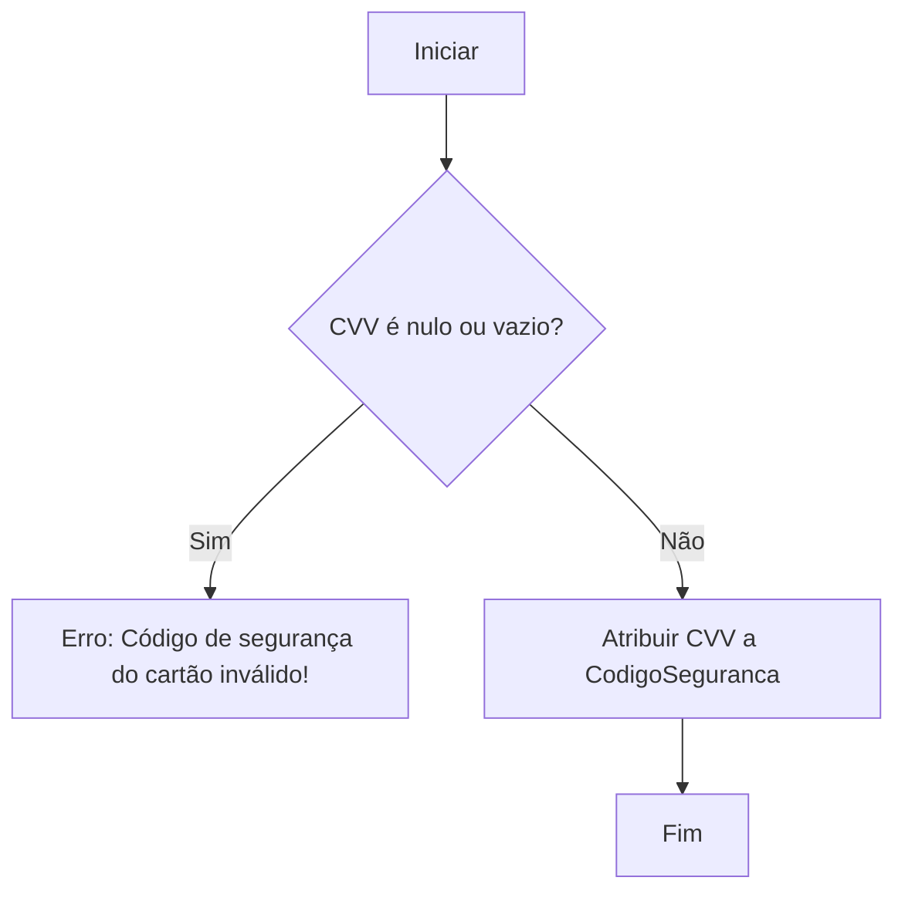
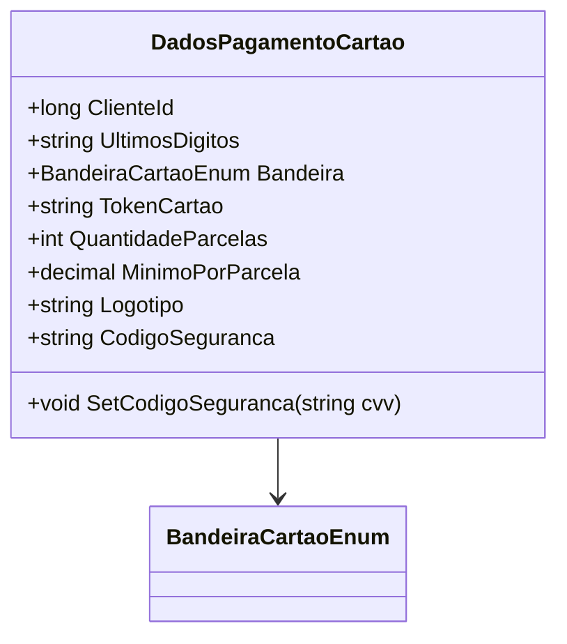

# DadosPagamentoCartao
**Namespace**: IsthmusWinthor.Dominio.POCO.Carrinho  
**Nome do Arquivo**: DadosPagamentoCartao.cs  

## Visão Geral e Responsabilidade
A classe `DadosPagamentoCartao` atua como um modelo rico que encapsula as informações necessárias para processar pagamentos via cartão de crédito. Ela resolve o problema de garantir a integridade e segurança das informações do cartão durante o fluxo de pagamento, considerando as regras de negócio associadas ao gerenciamento de dados sensíveis do cliente.

## Métodos de Negócio

### Método: `SetCodigoSeguranca` (public)
- **Objetivo**: Garante que o código de segurança do cartão (CVV) seja definido de forma segura, prevenindo valores inválidos ou nulos.
- **Comportamento**:
  1. Recebe um parâmetro `cvv`.
  2. Verifica se o valor do `cvv` é nulo ou vazio.
  3. Se for inválido, lança uma exceção informando que o código de segurança é inválido.
  4. Caso contrário, atribui o valor do `cvv` à propriedade `CodigoSeguranca`.
- **Retorno**: Não retorna nenhum valor, mas assegura a integridade do código de segurança registrado.

## Propriedades Calculadas e de Validação
- `CodigoSeguranca`: Esta propriedade possui uma lógica de validação no método `SetCodigoSeguranca`, garantindo que seja sempre um valor válido quando definido.

## Navigations Property
- Não há propriedades de navegação complexas nesta classe.

## Tipos Auxiliares e Dependências
- Enum: `[BandeiraCartaoEnum](BandeiraCartaoEnum.md)`

## Diagrama de Relacionamentos

