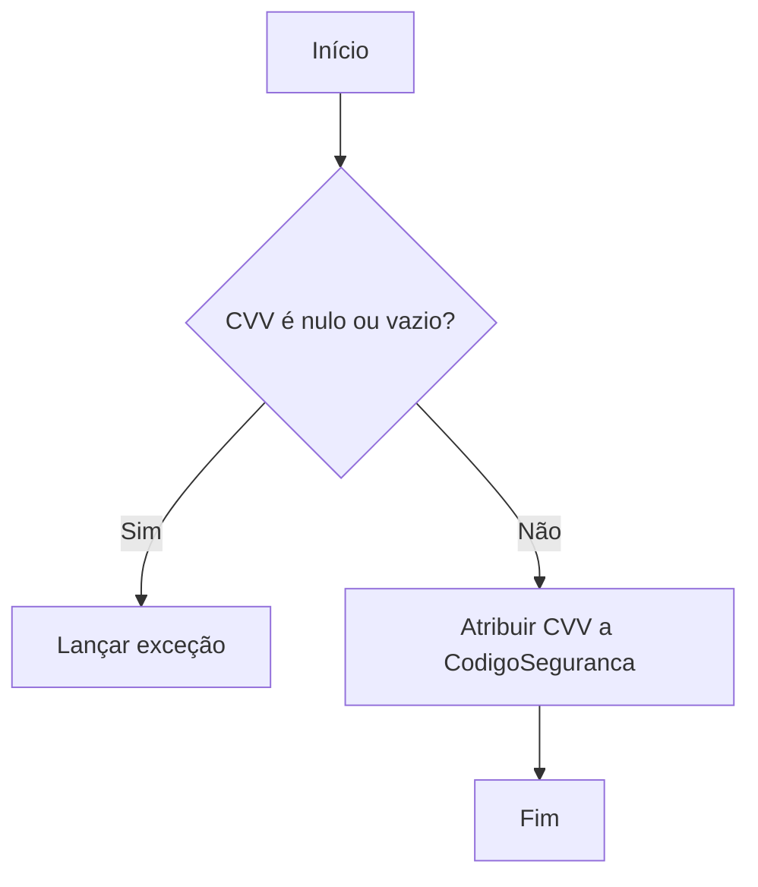
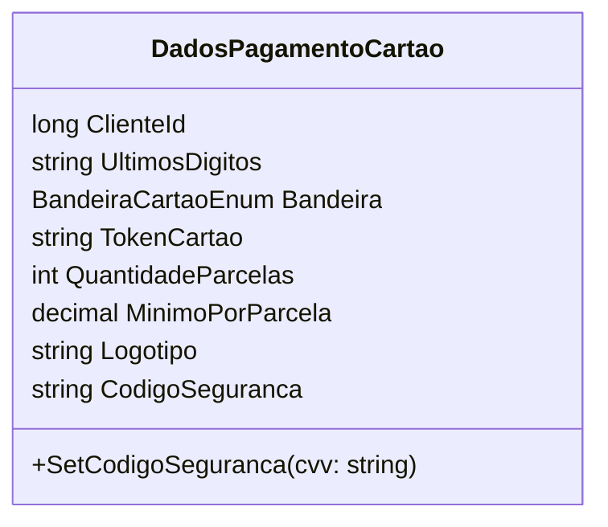

# DadosPagamentoCartao
**Namespace**: IsthmusWinthor.Dominio.POCO.Carrinho  
**Nome do Arquivo**: DadosPagamentoCartao.cs  

## Visão Geral e Responsabilidade
A classe `DadosPagamentoCartao` representa as informações necessárias para processar um pagamento via cartão em um sistema de carrinho de compras. Ela aborda a necessidade de capturar dados sensíveis e relacionados ao pagamento de forma a assegurar a integridade e segurança das informações do cliente.

## Métodos de Negócio

### Título: SetCodigoSeguranca (public)
- **Objetivo**: Garante que o código de segurança (CVV) do cartão seja definido apenas com valores válidos, evitando registros incorretos que poderiam afetar a segurança da transação.
- **Comportamento**:
  1. Recebe uma string `cvv` como parâmetro.
  2. Verifica se o valor de `cvv` é nulo ou vazio.
  3. Caso a validação falhe, lança uma exceção com a mensagem "Código de segurança do cartão inválido!".
  4. Se o valor for válido, atribui o `cvv` à propriedade privada `CodigoSeguranca`.
- **Retorno**: O método não retorna valores, mas garante que a propriedade `CodigoSeguranca` seja definida apenas com valores válidos.

### VISUALIZAÇÃO

## Propriedades Calculadas e de Validação
- **CodigoSeguranca**: Esta propriedade é validada na definição através do método `SetCodigoSeguranca`, que assegura que um código inválido não seja aceito, promovendo a segurança nas transações.

## Navigations Property
- Não há propriedades que são classes complexas do domínio.

## Tipos Auxiliares e Dependências
- **Enumeradores**:
  - [BandeiraCartaoEnum](BandeiraCartaoEnum.md)

## Diagrama de Relacionamentos

Esta documentação técnica garante uma visão clara e concisa sobre as regras de negócio e a integridade de dados geridas pela classe `DadosPagamentoCartao`, além de fornecer um suporte visual para a compreensão do fluxos lógicos envolvidos.
---
Gerada em 29/12/2025 21:40:30
