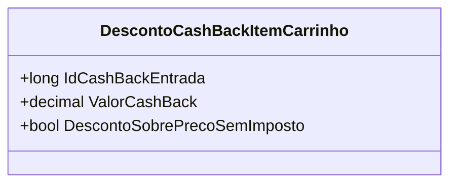

# DescontoCashBackItemCarrinho
**Namespace**: IsthmusWinthor.Dominio.POCO.Carrinho  
**Nome do Arquivo**: DescontoCashBackItemCarrinho.cs  

## Visão Geral e Responsabilidade
A classe `DescontoCashBackItemCarrinho` representa um desconto de cashback que é aplicado a um item específico dentro do carrinho de compras. O principal objetivo desta classe é gerenciar e calcular o valor do cashback que pode ser disponibilizado ao cliente por meio de uma entrada específica, permitindo melhorar a experiência de compra ao oferecer incentivos financeiros. Essa funcionalidade é essencial em um ambiente de e-commerce onde a retenção do cliente e a promoção de vendas são fundamentais.

## Métodos de Negócio
Atualmente, não há métodos definidos na classe `DescontoCashBackItemCarrinho` que contenham lógica de negócio relevante. A classe é composta apenas por propriedades que representam as informações necessárias para o cálculo de cashback, sem operações adicionais.

## Propriedades Calculadas e de Validação
Atualmente, a classe não possui propriedades calculadas ou validação nas propriedades set. Todas as propriedades são anêmicas e simplesmente transportam informações.

## Navigations Property
Atualmente, não há propriedades que representam classes complexas do domínio. Todas as propriedades são simples e de tipos primitivos.

## Tipos Auxiliares e Dependências
Atualmente, a classe não faz uso de tipos auxiliares, enumeradores ou classes estáticas/helpers.

## Diagrama de Relacionamentos

---
Gerada em 29/12/2025 21:40:39
