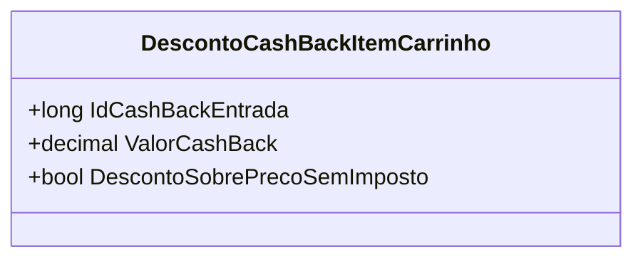

# DescontoCashBackItemCarrinho
**Namespace**: IsthmusWinthor.Dominio.POCO.Carrinho  
**Nome do Arquivo**: DescontoCashBackItemCarrinho.cs

## Visão Geral e Responsabilidade
A classe `DescontoCashBackItemCarrinho` representa um desconto de cashback que é aplicado a um item específico dentro de um carrinho de compras. O principal problema de negócio que ela resolve é a necessidade de rastrear os descontos de cashback associados a compras, permitindo que o sistema calcule e aplique corretamente o valor de cashback devido a uma entrada específica quando um item é adquirido.

## Métodos de Negócio
Esta classe não possui métodos com lógica de negócio além de setters simples. Portanto, não há métodos a serem documentados nesse item.

## Propriedades Calculadas e de Validação
Esta classe não possui propriedades calculadas ou validações no `set`.

## Navigations Property
Esta classe não contém propriedades que são classes complexas do domínio.

## Tipos Auxiliares e Dependências
- Nenhum enumerador ou classe estática/helper é utilizado nesta classe.

## Diagrama de Relacionamentos

