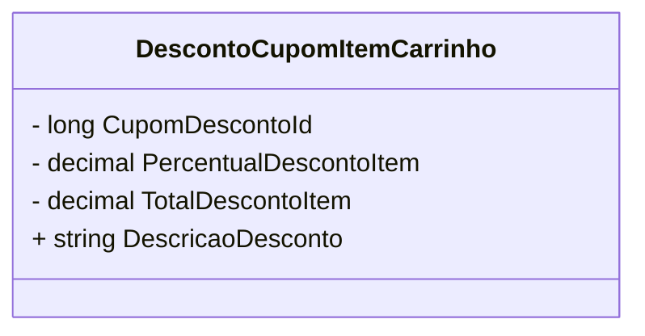

# DescontoCupomItemCarrinho
**Namespace**: IsthmusWinthor.Dominio.POCO.Carrinho  
**Nome do Arquivo**: DescontoCupomItemCarrinho.cs  

## Visão Geral e Responsabilidade
A classe `DescontoCupomItemCarrinho` representa a lógica para a aplicação de descontos em itens de um carrinho de compras. Sua principal responsabilidade é encapsular as regras de negócio relacionadas à gestão de cupons de desconto, seja em formato percentual ou valor fixo, garantindo a correta aplicação do desconto durante a finalização da compra.

## Métodos de Negócio
### 1. **DescriçãoDesconto** (Público)
**Objetivo:** Fornecer uma descrição formatada do desconto aplicado ao item do carrinho.  
**Comportamento:** O método acessa a propriedade `TotalDescontoItem`, converte seu valor em um formato monetário apropriado e concatena a string "Cupom" com o valor do desconto.  
**Retorno:** Retorna uma string que representa a descrição do desconto a ser apresentava ao usuário.  

```mermaid
flowchart TD
    A[Início] --> B{Valor de TotalDescontoItem > 0}
    B -- Sim --> C[Executar TotalDescontoItem.ToMoney()]
    C --> D[Criar string "Cupom X OFF"]
    B -- Não --> E[Retornar "Cupom 0 OFF"]
    E --> D
    D --> F[Fim]
```

## Propriedades Calculadas e de Validação
### 1. **DescricaoDesconto**
- **Regra:** A descrição do desconto é gerada a partir do total de desconto aplicado e formata o valor em uma string que pode ser exibida ao usuário. Este cálculo é crucial para que o cliente tenha clareza sobre os descontos que está recebendo.

## Navigation Property
- Não existem propriedades de navegação listadas na classe atual.

## Tipos Auxiliares e Dependências
- `ToMoney()` - Método auxiliar presumido que formata um valor decimal como uma string monetária. Detalhes adicionais sobre este método devem ser documentados na classe auxiliar correspondente.  

## Diagrama de Relacionamentos


Este diagrama representa a classe `DescontoCupomItemCarrinho`, incluindo suas propriedades e suas responsabilidades, mas não contém ligações a outras classes, pois não há referências a tipos ou dependências adicionais.
