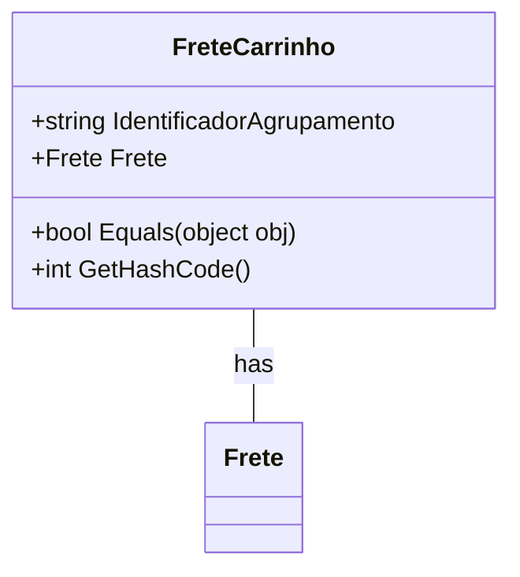

# FreteCarrinho
**Namespace**: IsthmusWinthor.Dominio.POCO.Carrinho  
**Nome do Arquivo**: FreteCarrinho.cs  

## Visão Geral e Responsabilidade
A classe `FreteCarrinho` é responsável por gerenciar as informações relacionadas ao frete de um carrinho de compras. Ela é utilizada para identificar o agrupamento ao qual a opção de frete escolhida pertence e armazenar a opção de frete selecionada. Sua finalidade é apoiar a lógica de cálculo e seleção de frete em um sistema de e-commerce, garantindo que o desconto e a seleção do frete sejam aplicados corretamente no carrinho.

## Métodos de Negócio
### Título: Equals (public)
- **Objetivo**: Garante que duas instâncias de `FreteCarrinho` sejam consideradas iguais se compartilham o mesmo `IdentificadorAgrupamento`.
- **Comportamento**:
  1. Recebe um objeto como parâmetro.
  2. Verifica se o objeto recebido é do tipo `FreteCarrinho`.
  3. Compara o `IdentificadorAgrupamento` da instância atual com o do objeto passado.
- **Retorno**: Retorna `true` se ambos os `IdentificadorAgrupamento` forem iguais, caso contrário, retorna `false`.

### Título: GetHashCode (public)
- **Objetivo**: Garante a integridade dos objetos em coleções baseadas em hash (como dicionários), proporcionando um código de hash exclusivo para a instância de `FreteCarrinho`.
- **Comportamento**:
  1. Utiliza o `HashCode.Combine` para gerar um código de hash baseado no `IdentificadorAgrupamento`.
  2. Retorna esse código de hash como resultado.
- **Retorno**: Um valor inteiro que representa o código de hash da instância.

## Propriedades Calculadas e de Validação
- **IdentificadorAgrupamento**: Este campo armazena o identificador do agrupamento do frete. Sua presença ou ausência é utilizada para determinar como o frete deve ser calculado. Um valor vazio indica que não há agrupamento aplicado para o frete.

## Navigations Property
- **Frete**: `Frete` representa a opção de frete selecionada para o carrinho. [Frete](Frete.md)

## Tipos Auxiliares e Dependências
- **Frete**: Este tipo pode ser uma classe que representa as opções de frete disponíveis, a qual é utilizada para armazenar a opção de frete selecionada.

## Diagrama de Relacionamentos

Esta documentação fornece uma visão abrangente da classe `FreteCarrinho`, destacando suas regras de negócio e integrações no contexto de um sistema de carrinho de compras.
