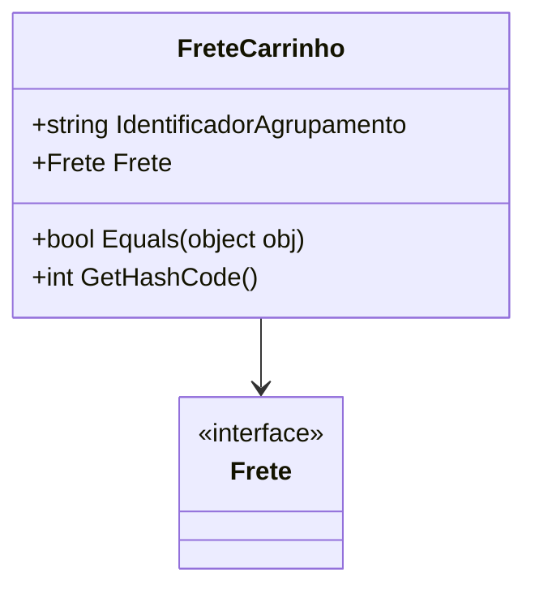

# FreteCarrinho
**Namespace**: IsthmusWinthor.Dominio.POCO.Carrinho  
**Nome do Arquivo**: FreteCarrinho.cs  

## Visão Geral e Responsabilidade
A classe `FreteCarrinho` representa as opções de frete disponíveis para um carrinho de compras em um sistema de e-commerce. Ela encapsula a lógica para identificar um agrupamento de frete e a seleção de um frete específico, permitindo que o sistema gerencie e processe corretamente as opções de envio para as compras dos usuários. Essa classe é fator-chave na determinação do custo de envio e na união de vários itens de envio em uma única carga, se aplicável.

## Métodos de Negócio

### Título: Equals (override)
- **Objetivo**: Garante a unicidade da opção de frete com base no `IdentificadorAgrupamento`.
- **Comportamento**: 
    1. Recebe um objeto e verifica se ele é do tipo `FreteCarrinho`.
    2. Compara o `IdentificadorAgrupamento` do objeto atual com o do objeto recebido.
    3. Retorna `true` se os identificadores forem iguais, indicando que são da mesma opção de frete; caso contrário, retorna `false`.
- **Retorno**: Retorna um valor booleano que indica se os dois objetos `FreteCarrinho` são equivalentes com base no `IdentificadorAgrupamento`.

### Título: GetHashCode (override)
- **Objetivo**: Garante que a classe tenha um código de hash consistente para operações de comparação em coleções.
- **Comportamento**: 
    1. Usa o método `HashCode.Combine` para gerar um código de hash único baseado em `IdentificadorAgrupamento`.
- **Retorno**: Retorna um valor inteiro que representa o código de hash único do `FreteCarrinho`.

## Propriedades Calculadas e de Validação
Não existem propriedades com lógica de validação ou com cálculos complexos na classe `FreteCarrinho`. As propriedades `IdentificadorAgrupamento` e `Frete` são de acesso simples.

## Navigations Property
- [Frete](Frete.md)

## Tipos Auxiliares e Dependências
- [Frete](Frete.md)

## Diagrama de Relacionamentos

Essa estrutura fornece um entendimento claro da classe `FreteCarrinho`, seu propósito, suas operações e suas interações com outras entidades no domínio, contribuindo para a integridade de dados e aplicação das regras de negócios relevantes.
---
Gerada em 29/12/2025 21:41:05
