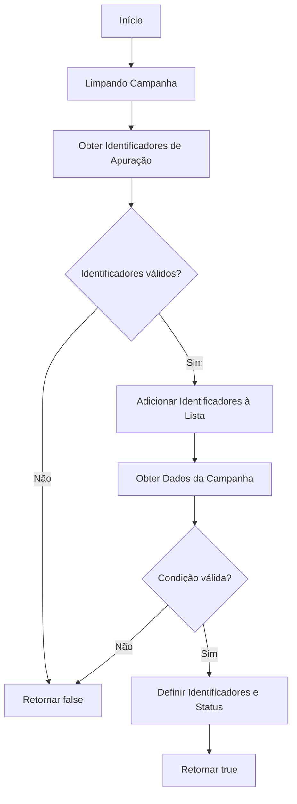
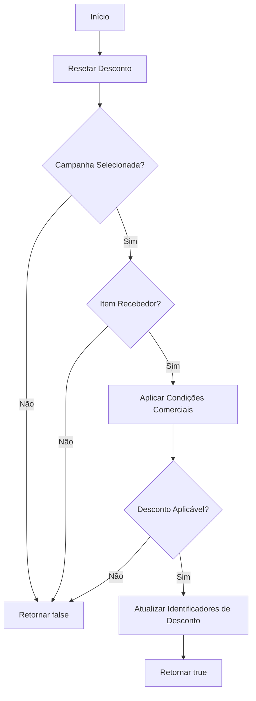
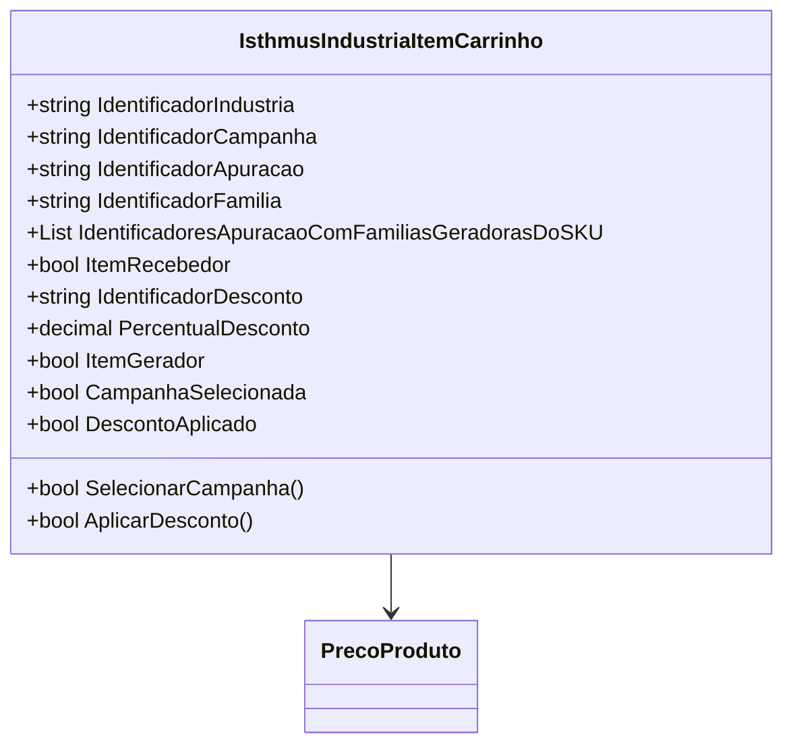

# IsthmusIndustriaItemCarrinho
**Namespace**: IsthmusWinthor.Dominio.POCO.Carrinho  
**Nome do Arquivo**: IsthmusIndustriaItemCarrinho.cs

## Visão Geral e Responsabilidade
A classe `IsthmusIndustriaItemCarrinho` representa um item dentro do carrinho de compras em um sistema de e-commerce, especificamente para a indústria Isthmus. Esta classe gerencia a seleção de campanhas comerciais e a aplicação de descontos, garantindo que as regras de negócio associadas à validação de campanhas e descontos sejam rigorosamente seguidas. O objetivo principal é permitir a manipulação eficiente dos itens do carrinho, com foco em suas condições comerciais e promoção de vendas específicas.

## Métodos de Negócio

### SelecionarCampanha
- **Título**: SelecionarCampanha (public)
- **Objetivo**: Garantir que o item do carrinho selecione uma campanha aplicável com base no código de barras do produto.
- **Comportamento**:
    1. Chama o método `LimparCampanhaSelecionada` para resetar os campos da campanha atual.
    2. Limpa a lista de identificadores de apuração.
    3. Obtém os identificadores de apuração compatíveis usando o `PrecoProduto`.
    4. Se houver identificadores válidos, adiciona-os à lista de identificadores de apuração.
    5. Recupera as condições relativas à campanha a ser aplicada.
    6. Se as condições não forem válidas, retorna `false`.
    7. Se as condições forem válidas, define os identificadores da indústria, família, campanha e apuração.
    8. Define o status do item como recebedor, baseado na validade das condições.
    9. Retorna `true` se a campanha foi selecionada com sucesso.
- **Retorno**: `true` se a campanha foi selecionada, `false` caso contrário.

### AplicarDesconto
- **Título**: AplicarDesconto (public)
- **Objetivo**: Garantir a aplicação correta de um desconto ao item do carrinho, considerando as condições da campanha selecionada.
- **Comportamento**:
    1. Reseta o identificador e percentual do desconto.
    2. Verifica se a campanha foi selecionada e se o item é um recebedor válido.
    3. Se as condições não forem cumpridas, retorna `false`.
    4. Aplica as condições comerciais utilizando uma função do `PrecoProduto`.
    5. Se um desconto aplicável foi encontrado, atualiza os valores de identificador e percentual do desconto.
    6. Retorna `true` se o desconto foi aplicado.
- **Retorno**: `true` se o desconto foi aplicado, `false` caso contrário.

## Propriedades Calculadas e de Validação
- **ItemGerador**: Avalia se existem identificadores de apuração associados a este item, retornando `true` se houver.
- **CampanhaSelecionada**: Verifica se foram definidos todos os identificadores necessários para uma campanha válida.
- **DescontoAplicado**: Confirma se uma campanha válida foi selecionada e um desconto foi efetivamente aplicado.

## Navigation Property
- [PrecoProduto](PrecoProduto.md)

## Tipos Auxiliares e Dependências
- [CondicaoIsthmusIndustriaItemCarrinhoModel](CondicaoIsthmusIndustriaItemCarrinhoModel.md)
- [DescontoIsthmusIndustriaAplicavelModel](DescontoIsthmusIndustriaAplicavelModel.md)

## Diagrama de Relacionamentos

