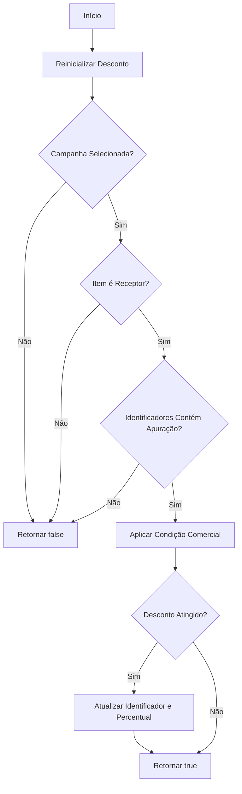
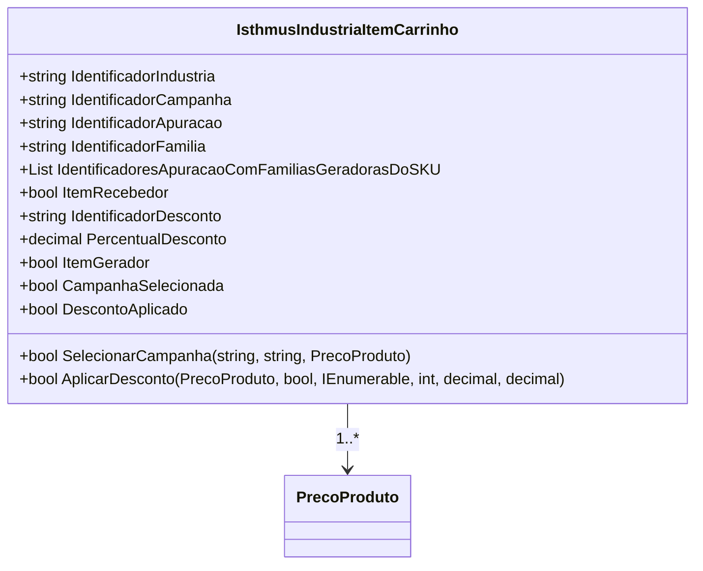

# IsthmusIndustriaItemCarrinho
- **Namespace**: IsthmusWinthor.Dominio.POCO.Carrinho
- **Nome do Arquivo**: IsthmusIndustriaItemCarrinho.cs

## Visão Geral e Responsabilidade
A classe `IsthmusIndustriaItemCarrinho` representa um item no carrinho de compras para indústrias, permitindo a seleção e aplicação de campanhas e descontos associados a produtos. Essa classe é fundamental para garantir que os itens do carrinho sejam processados corretamente com base nas condições comerciais vigentes, assegurando que descontos sejam aplicados adequadamente e que as campanhas de vendas gerenciem a seleção do item correspondente.

## Métodos de Negócio

### SelecionarCampanha
- **Título**: SelecionarCampanha (public)
- **Objetivo**: Garantir que uma campanha válida seja selecionada e que os identificadores necessários para a promoção sejam armazenados.
- **Comportamento**:
  1. Chama o método `LimparCampanhaSelecionada` para reinicializar os dados da campanha anterior.
  2. Limpa a lista de identificadores de apuração.
  3. Obtém os identificadores de apuração correspondentes ao código de barras passado através do `precoProduto`.
  4. Se houver identificadores, adiciona-os à lista `IdentificadoresApuracaoComFamiliasGeradorasDoSKU`.
  5. Obtém os dados da condição comercial para a campanha específica.
  6. Se a condição não for válida, retorna falso.
  7. Caso contrário, atualiza os identificadores de indústria, família, campanha e apuração.
  8. Retorna um booleano indicando se a campanha foi selecionada com sucesso.
- **Retorno**: `true` se a campanha foi selecionada e está válida, caso contrário, `false`.

```mermaid
flowchart TD
    A[Início] --> B[LimparCampanhaSelecionada()]
    B --> C[Limpar Identificadores]
    C --> D[Obter Identificadores]
    D --> E{Identificadores Encontrados?}
    E -- Sim --> F[Adicionar Identificadores]
    E -- Não --> G[Ir para Condição]
    F --> G
    G --> H[Obter Dados da Condição]
    H --> I{Condição Válida?}
    I -- Sim --> J[Atualizar Identificadores]
    J --> K[Retornar true]
    I -- Não --> L[Retornar false]
```

### AplicarDesconto
- **Título**: AplicarDesconto (public)
- **Objetivo**: Aplicar o desconto a um item baseado nas condições comerciais e verificar se é aplicável.
- **Comportamento**:
  1. Reinicializa os campos `IdentificadorDesconto` e `PercentualDesconto`.
  2. Verifica se a campanha foi selecionada e se o item é um receptor e pertence à lista de identificadores.
  3. Se qualquer condição falhar, retorna falso.
  4. Chama o método `AplicarCondicaoComercial` da condição comercial do `precoProduto` para calcular o desconto aplicável.
  5. Se o desconto foi atingido, atualiza os campos de desconto.
  6. Retorna um booleano indicando se o desconto foi aplicado com sucesso.
- **Retorno**: `true` se o desconto foi aplicado, caso contrário, `false`.



## Propriedades Calculadas e de Validação
- **ItemGerador**: Indica se o item possui identificadores de apuração. Retorna `true` se houver pelo menos um identificador na lista `IdentificadoresApuracaoComFamiliasGeradorasDoSKU`.
- **CampanhaSelecionada**: Verifica se todos os identificadores necessários para uma campanha estão preenchidos. Retorna `true` se os identificadores não forem nulos ou espaços em branco.
- **DescontoAplicado**: Checa se há uma campanha selecionada e se um desconto foi configurado corretamente. Retorna `true` se o desconto estiver aplicável.

## Navigations Property
- [PrecoProduto](PrecoProduto.md)

## Tipos Auxiliares e Dependências
- Nenhum enumerador ou classe estática/auxiliar diretamente utilizada.

## Diagrama de Relacionamentos

---
Gerada em 29/12/2025 21:41:32
